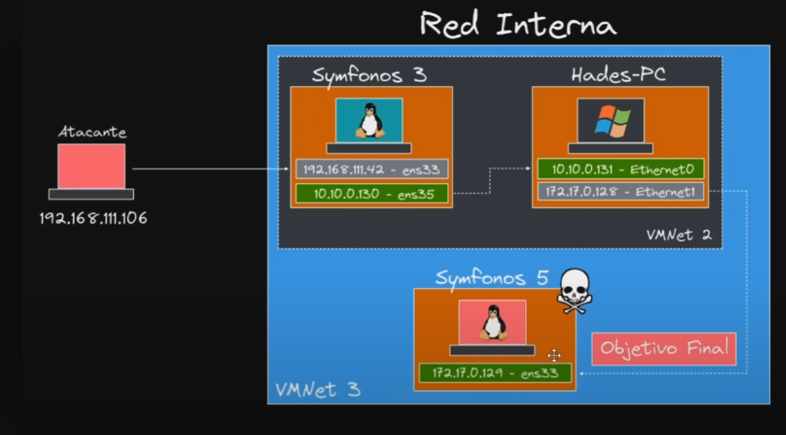

### Hack The Box Writeup: Pivoting 2 [SYmphonos 3, Hades, Symphonos 5]



## Overview

- **Machine Name**: 
- **Difficulty**: \[e.g., Easy, Medium, Hard\]
- **Platform**: Hack The Box
- **Operating System**: \[e.g., Linux, Windows\]
- **Key Objectives**: \[Briefly describe what you aimed to achieve, e.g., Gain root/admin access, exploit a specific vulnerability\]
- **Date Solved**: \[e.g., May 2025\]

This writeup details my approach to solving the \[Machine Name\] machine on Hack The Box, including enumeration, exploitation, and privilege escalation. The focus was on \[key techniques, e.g., exploiting outdated software, privilege escalation via misconfigurations\].

## Tools Used

- **Enumeration**: \[e.g., Nmap, Gobuster\]
- **Exploitation**: \[e.g., Metasploit, Custom Python scripts\]
- **Privilege Escalation**: \[e.g., LinPEAS, Windows Exploit Suggester\]
- **Other**: \[e.g., Burp Suite, Wireshark\]

## Methodology

### Initial Enumeration

\[Describe the initial steps to gather information about the target machine. Include commands and outputs.\]

```bash
# Example: Port scanning with Nmap
nmap -sC -sV -oA initial_scan [machine_ip]
```

\[Explain findings, e.g., open ports, services, versions.\]

### Exploitation

\[Detail the exploitation process, including vulnerabilities targeted and how you exploited them.\]

```bash
# Example: Exploiting Samba with Metasploit
msfconsole
use exploit/multi/samba/usermap_script
set RHOSTS [machine_ip]
run
```

\[Describe the outcome, e.g., initial shell access, user-level credentials.\]

### Privilege Escalation

\[Explain how you escalated privileges to root/admin. Include any misconfigurations or exploits used.\]

```bash
# Example: Checking for SUID binaries
find / -perm -4000 2>/dev/null
```

\[Describe the final access achieved, e.g., root shell, admin credentials.\]

## Challenges Faced

\[List specific challenges encountered, e.g., difficulty identifying the correct exploit, dealing with restricted shells.\]

- **Challenge 1**: \[e.g., Nmap scans were blocked by a firewall.\]
  - **Solution**: \[e.g., Used --script-args to bypass restrictions.\]
- **Challenge 2**: \[e.g., Password cracking took too long.\]
  - **Solution**: \[e.g., Optimized wordlist with custom rules in Hashcat.\]

## Lessons Learned

\[Summarize key takeaways from solving the machine.\]

- Learned to identify \[specific vulnerability, e.g., outdated Samba versions\] through thorough enumeration.
- Improved skills in \[technique, e.g., manual exploit development for CVE-XXXX-XXXX\].
- Gained experience with \[tool, e.g., LinPEAS for privilege escalation\].

## References

- \[Link to HTB machine page, e.g., https://app.hackthebox.com/machines/Lame\]
- \[CVE details, e.g., https://cve.mitre.org/cgi-bin/cvename.cgi?name=CVE-XXXX-XXXX\]
- \[Tool documentation, e.g., https://nmap.org/book/man.html\]
- \[Relevant blog post or tutorial, e.g., https://example.com/samba-exploit-guide\]

---

*Written by YourName, \[Month Year\]. Feedback welcome at \[your contact, e.g., GitHub profile\].*